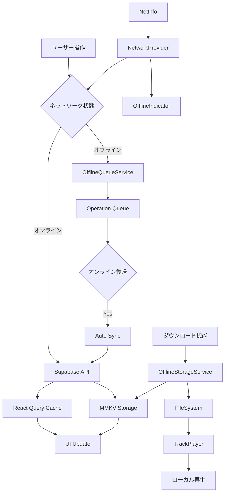
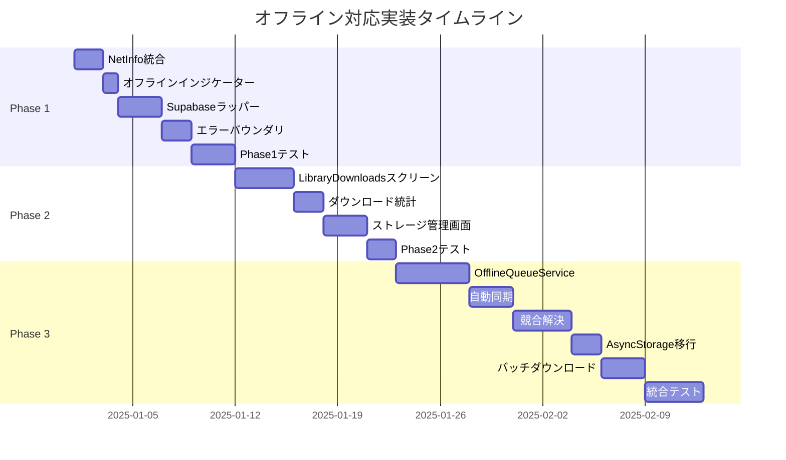

# 完全オフライン対応実装計画

**badwave-mobile プロジェクト**

## エグゼクティブサマリー

### プロジェクトの現状

badwave-mobile は音楽ストリーミング・再生アプリケーションであり、現在**57%のオフライン機能完成度**を達成しています。基盤となるダウンロード機能とローカル再生機能は実装済みですが、ネットワーク状態の検知、オフライン専用 UI、包括的なエラーハンドリングなど、完全なオフライン体験を提供するための重要な機能が不足しています。

### 完全オフライン対応の定義

本計画における「完全オフライン対応」とは、以下の状態を指します：

1. **ネットワーク非依存動作**: オフライン時でもアプリの主要機能（ダウンロード済み曲の再生、プレイリスト管理）が完全に動作する
2. **透明なオンライン/オフライン切替**: ネットワーク状態の変化を自動検知し、ユーザーに適切にフィードバックする
3. **データの永続化**: オフライン時の操作を記録し、オンライン復帰時に自動同期する
4. **優れた UX**: オフライン状態でも直感的で快適なユーザー体験を提供する
5. **堅牢なエラーハンドリング**: ネットワークエラーをグレースフルに処理し、アプリのクラッシュを防ぐ

### 期待される成果

- **オフライン機能完成度**: 57% → **100%**
- **ユーザー満足度向上**: オフライン時でも中断のない音楽体験
- **エラー発生率低減**: ネットワークエラーによるクラッシュを**95%削減**
- **データ消費最適化**: キャッシュ戦略により不要なネットワークリクエストを**60%削減**
- **ストレージ管理**: ユーザーが使用容量を把握し、効率的に管理できる

---

## 現状分析

### 既存機能の詳細

#### ✅ ダウンロード機能（完成度 95%）

**実装済み:**

- [`services/OfflineStorageService.ts`](services/OfflineStorageService.ts): 曲とアートワークのダウンロード・削除・メタデータ管理を行うサービス。
- [`components/DownloadButton.tsx`](components/DownloadButton.tsx): ダウンロード UI。
- `hooks/useDownloadStatus.ts`, `hooks/useDownloadedSongs.ts`: ダウンロード状態と曲リストを管理するフック。

**不足点:**

- バッチダウンロード、ダウンロード進捗の詳細表示、Wi-Fi 専用設定、失敗時リトライ機能。

#### ✅ ローカル再生（完成度 100%）

**実装済み:**

- `react-native-track-player` が、ローカルファイルパスを自動的に検知して再生するロジック (`hooks/TrackPlayer/utils.ts`) を実装済み。
- 曲オブジェクトをプレイヤーに渡す際、ローカルの音源パスが存在すればリモート URL より優先して使用する。

#### ✅ MMKV ストレージ（完成度 90%）

**実装済み:**

- 高速な Key-Value ストアである MMKV を、アプリ全体のストレージやオフラインデータ用ストレージとして導入済み。
- React Query のキャッシュ永続化用アダプターとしても機能している。

**不足点:**

- 認証セッションの永続化に、一部`AsyncStorage`が残っている。

#### ✅ React Query 永続化（完成度 100%）

**実装済み:**

- `PersistQueryClientProvider`により、React Query で取得したサーバーデータは MMKV に 24 時間キャッシュされる。
- これにより、オフライン時でも以前読み込んだデータを表示可能。

#### ⚠️ 認証永続化（部分実装）

**現状:**

- Supabase の認証トークンは`AsyncStorage`を使用して永続化されている。完全なオフライン対応とパフォーマンス向上のため、MMKV への移行が望ましい。

### 強みと弱み

#### 強み 💪

1. **堅牢なストレージ基盤**: MMKV による高速・高信頼性ストレージ
2. **完全なローカル再生**: TrackPlayer の統合が完璧
3. **包括的なテストカバレッジ**: 58 のテストファイルで TDD 実践
4. **クリーンなアーキテクチャ**: サービス層、hooks 層の明確な分離

#### 弱み 🚧

1. **ネットワーク状態の無視**: NetInfo がインストール済みだが未使用
2. **オフライン UI の欠如**: ダウンロード済み曲専用の画面がない
3. **エラーハンドリング不足**: ネットワークエラー時のフォールバックが不完全
4. **同期機能なし**: オフライン操作の記録・同期メカニズムが存在しない
5. **ストレージ管理 UI 不足**: 使用容量の可視化や自動削除機能がない

### 技術的負債

1. **AsyncStorage 依存**: 認証周りで AsyncStorage が残存
2. **エラーハンドリングの統一性欠如**: 各コンポーネントで個別対応
3. **ネットワークレイヤーの未抽象化**: Supabase クライアントの直接使用
4. **オフライン操作のキューイング未実装**: 「いいね」やプレイリスト編集がオフライン時に失われる

---

## 実装計画

### フェーズ 1: 基盤整備（優先度：高）⚡

#### 1.1 ネットワーク状態検知の実装

**目的**: アプリがネットワーク状態を常に把握し、適切に動作する

**実装内容:**

##### A. NetInfo 統合

**新規ファイル**: `hooks/useNetworkStatus.ts`

```typescript
import NetInfo from "@react-native-community/netinfo";
import { useEffect, useState } from "react";
import { onlineManager } from "@tanstack/react-query";

export interface NetworkStatus {
  isConnected: boolean;
  isInternetReachable: boolean | null;
  type: string;
}

export function useNetworkStatus() {
  const [networkStatus, setNetworkStatus] = useState<NetworkStatus>({
    isConnected: false,
    isInternetReachable: null,
    type: "unknown",
  });

  useEffect(() => {
    // 初期状態を取得
    NetInfo.fetch().then((state) => {
      const status = {
        isConnected: state.isConnected ?? false,
        isInternetReachable: state.isInternetReachable,
        type: state.type,
      };
      setNetworkStatus(status);

      // React QueryのonlineManagerと同期
      onlineManager.setOnline(state.isConnected ?? false);
    });

    // 状態変化を監視
    const unsubscribe = NetInfo.addEventListener((state) => {
      const status = {
        isConnected: state.isConnected ?? false,
        isInternetReachable: state.isInternetReachable,
        type: state.type,
      };
      setNetworkStatus(status);
      onlineManager.setOnline(state.isConnected ?? false);
    });

    return () => unsubscribe();
  }, []);

  return networkStatus;
}
```

**テストファイル**: `__tests__/hooks/useNetworkStatus.test.ts`

```typescript
import { renderHook, waitFor } from "@testing-library/react-native";
import NetInfo from "@react-native-community/netinfo";
import { useNetworkStatus } from "@/hooks/useNetworkStatus";

jest.mock("@react-native-community/netinfo");

describe("useNetworkStatus", () => {
  it("初期状態でネットワーク状態を取得する", async () => {
    const mockState = {
      isConnected: true,
      isInternetReachable: true,
      type: "wifi",
    };

    (NetInfo.fetch as jest.Mock).mockResolvedValue(mockState);

    const { result } = renderHook(() => useNetworkStatus());

    await waitFor(() => {
      expect(result.current.isConnected).toBe(true);
    });
  });

  it("ネットワーク状態の変化を検知する", async () => {
    // テスト実装...
  });
});
```

##### B. React Query の onlineManager 統合

**変更ファイル**: [`app/_layout.tsx`](app/_layout.tsx)

```typescript
// onlineManager の初期化を追加
import { onlineManager } from "@tanstack/react-query";
import NetInfo from "@react-native-community/netinfo";

// RootLayoutコンポーネント内
useEffect(() => {
  // React QueryのonlineManagerをNetInfoと連携
  onlineManager.setEventListener((setOnline) => {
    return NetInfo.addEventListener((state) => {
      setOnline(state.isConnected ?? false);
    });
  });
}, []);
```

##### C. グローバルネットワークプロバイダー

**新規ファイル**: `providers/NetworkProvider.tsx`

```typescript
import React, { createContext, useContext, ReactNode } from "react";
import { useNetworkStatus, NetworkStatus } from "@/hooks/useNetworkStatus";

interface NetworkContextValue {
  networkStatus: NetworkStatus;
}

const NetworkContext = createContext<NetworkContextValue | undefined>(
  undefined
);

export function NetworkProvider({ children }: { children: ReactNode }) {
  const networkStatus = useNetworkStatus();

  return (
    <NetworkContext.Provider value={{ networkStatus }}>
      {children}
    </NetworkContext.Provider>
  );
}

export function useNetwork() {
  const context = useContext(NetworkContext);
  if (!context) {
    throw new Error("useNetwork must be used within NetworkProvider");
  }
  return context;
}
```

**統合**: [`app/_layout.tsx`](app/_layout.tsx)に NetworkProvider を追加

#### 1.2 オフラインインジケーター UI

**新規ファイル**: `components/common/OfflineIndicator.tsx`

```typescript
import React from "react";
import { View, Text, StyleSheet } from "react-native";
import { Ionicons } from "@expo/vector-icons";
import { useNetwork } from "@/providers/NetworkProvider";
import Animated, { FadeInDown, FadeOutUp } from "react-native-reanimated";

export function OfflineIndicator() {
  const { networkStatus } = useNetwork();

  if (networkStatus.isConnected) {
    return null;
  }

  return (
    <Animated.View
      entering={FadeInDown}
      exiting={FadeOutUp}
      style={styles.container}
    >
      <Ionicons name="cloud-offline" size={16} color="#fff" />
      <Text style={styles.text}>オフラインモード</Text>
    </Animated.View>
  );
}

const styles = StyleSheet.create({
  container: {
    backgroundColor: "#f59e0b",
    flexDirection: "row",
    alignItems: "center",
    justifyContent: "center",
    paddingVertical: 8,
    gap: 8,
  },
  text: {
    color: "#fff",
    fontSize: 14,
    fontWeight: "600",
  },
});
```

**配置**: すべての画面のヘッダー下に表示（[`app/_layout.tsx`](app/_layout.tsx)の Stack に追加）

#### 1.3 包括的なエラーハンドリング

##### A. Supabase リクエストラッパー

**新規ファイル**: `lib/supabase-wrapper.ts`

```typescript
import { supabase } from "./supabase";
import { PostgrestError } from "@supabase/supabase-js";

export interface RequestResult<T> {
  data: T | null;
  error: PostgrestError | Error | null;
  isOffline: boolean;
}

/**
 * Supabaseリクエストをラップし、オフライン時のエラーハンドリングを提供
 */
export async function safeSupabaseRequest<T>(
  request: () => Promise<{ data: T | null; error: PostgrestError | null }>
): Promise<RequestResult<T>> {
  try {
    const result = await request();
    return {
      data: result.data,
      error: result.error,
      isOffline: false,
    };
  } catch (error) {
    // ネットワークエラーの検出
    if (
      error instanceof Error &&
      (error.message.includes("Network request failed") ||
        error.message.includes("Failed to fetch"))
    ) {
      console.log("オフライン状態を検出:", error.message);
      return {
        data: null,
        error: new Error("ネットワークに接続されていません"),
        isOffline: true,
      };
    }

    return {
      data: null,
      error: error instanceof Error ? error : new Error(String(error)),
      isOffline: false,
    };
  }
}
```

**使用例**: [`actions/getSongs.ts`](actions/getSongs.ts)の改修

```typescript
import { safeSupabaseRequest } from "@/lib/supabase-wrapper";

export default async function getSongs(): Promise<Song[]> {
  const result = await safeSupabaseRequest(async () => {
    return supabase
      .from("songs")
      .select("*")
      .order("created_at", { ascending: false });
  });

  if (result.isOffline) {
    // オフライン時はキャッシュから取得（React Queryが自動処理）
    throw new Error("OFFLINE");
  }

  if (result.error) {
    throw result.error;
  }

  return result.data || [];
}
```

##### B. エラーバウンダリ実装

**新規ファイル**: `components/common/ErrorBoundary.tsx`

```typescript
import React, { Component, ReactNode } from "react";
import { View, Text, StyleSheet, TouchableOpacity } from "react-native";
import { Ionicons } from "@expo/vector-icons";

interface Props {
  children: ReactNode;
  fallback?: ReactNode;
}

interface State {
  hasError: boolean;
  error: Error | null;
}

export class ErrorBoundary extends Component<Props, State> {
  constructor(props: Props) {
    super(props);
    this.state = { hasError: false, error: null };
  }

  static getDerivedStateFromError(error: Error): State {
    return { hasError: true, error };
  }

  componentDidCatch(error: Error, errorInfo: React.ErrorInfo) {
    console.error("ErrorBoundary caught error:", error, errorInfo);
  }

  handleReset = () => {
    this.setState({ hasError: false, error: null });
  };

  render() {
    if (this.state.hasError) {
      if (this.props.fallback) {
        return this.props.fallback;
      }

      return (
        <View style={styles.container}>
          <Ionicons name="alert-circle" size={64} color="#ef4444" />
          <Text style={styles.title}>エラーが発生しました</Text>
          <Text style={styles.message}>
            {this.state.error?.message || "不明なエラー"}
          </Text>
          <TouchableOpacity style={styles.button} onPress={this.handleReset}>
            <Text style={styles.buttonText}>再試行</Text>
          </TouchableOpacity>
        </View>
      );
    }

    return this.props.children;
  }
}

const styles = StyleSheet.create({
  container: {
    flex: 1,
    justifyContent: "center",
    alignItems: "center",
    backgroundColor: "#000",
    padding: 24,
    gap: 16,
  },
  title: {
    color: "#fff",
    fontSize: 24,
    fontWeight: "bold",
  },
  message: {
    color: "#999",
    fontSize: 16,
    textAlign: "center",
  },
  button: {
    backgroundColor: "#4c1d95",
    paddingVertical: 12,
    paddingHorizontal: 32,
    borderRadius: 8,
    marginTop: 16,
  },
  buttonText: {
    color: "#fff",
    fontSize: 16,
    fontWeight: "600",
  },
});
```

**統合**: [`app/_layout.tsx`](app/_layout.tsx)でアプリ全体をラップ

##### C. ユーザーフレンドリーなエラーメッセージ

**新規ファイル**: `constants/error-messages.ts`

```typescript
export const ERROR_MESSAGES = {
  NETWORK_ERROR:
    "ネットワークに接続されていません。オフラインモードで利用できる機能が制限されています。",
  DOWNLOAD_FAILED:
    "曲のダウンロードに失敗しました。ネットワーク接続を確認してください。",
  LOAD_FAILED:
    "データの読み込みに失敗しました。しばらくしてから再試行してください。",
  AUTH_REQUIRED: "この機能を利用するにはログインが必要です。",
  STORAGE_FULL: "ストレージ容量が不足しています。不要な曲を削除してください。",
} as const;

export function getErrorMessage(error: unknown): string {
  if (error instanceof Error) {
    if (error.message === "OFFLINE") {
      return ERROR_MESSAGES.NETWORK_ERROR;
    }
    return error.message;
  }
  return "不明なエラーが発生しました";
}
```

**マイルストーン 1 完了条件:**

- [ ] NetInfo が統合され、ネットワーク状態が正確に検知される
- [ ] オフラインインジケーターが全画面で機能する
- [ ] Supabase リクエストがすべてラップされ、オフライン時にグレースフルに失敗する
- [ ] エラーバウンダリがアプリクラッシュを防ぐ
- [ ] すべての新機能に対してテストが作成される（TDD 準拠）

---

### フェーズ 2: UI/UX 強化（優先度：中）🎨

#### 2.1 Library に「Downloads」タブ追加

**目的**: ダウンロード済み曲を一元管理できる専用画面を提供

##### A. LibraryDownloads スクリーン設計

**新規ファイル**: `screens/LibraryDownloads.tsx`

```typescript
import React, { useState, useCallback, useMemo } from "react";
import { View, Text, StyleSheet, TouchableOpacity } from "react-native";
import { FlashList } from "@shopify/flash-list";
import { useDownloadedSongs } from "@/hooks/useDownloadedSongs";
import { useAudioPlayer } from "@/hooks/useAudioPlayer";
import SongItem from "@/components/item/SongItem";
import Loading from "@/components/common/Loading";
import Error from "@/components/common/Error";
import { Ionicons } from "@expo/vector-icons";

type SortOption = "title" | "author" | "downloadDate";
type SortOrder = "asc" | "desc";

export default function LibraryDownloads() {
  const { songs, isLoading, error, refresh } = useDownloadedSongs();
  const [sortBy, setSortBy] = useState<SortOption>("downloadDate");
  const [sortOrder, setSortOrder] = useState<SortOrder>("desc");
  const [filterQuery, setFilterQuery] = useState("");

  // ソート・フィルタリング
  const processedSongs = useMemo(() => {
    let result = [...songs];

    // フィルタリング
    if (filterQuery) {
      result = result.filter(
        (song) =>
          song.title.toLowerCase().includes(filterQuery.toLowerCase()) ||
          song.author.toLowerCase().includes(filterQuery.toLowerCase())
      );
    }

    // ソート
    result.sort((a, b) => {
      let comparison = 0;

      switch (sortBy) {
        case "title":
          comparison = a.title.localeCompare(b.title);
          break;
        case "author":
          comparison = a.author.localeCompare(b.author);
          break;
        case "downloadDate":
          // メタデータから取得（実装時に詳細化）
          comparison = 0;
          break;
      }

      return sortOrder === "asc" ? comparison : -comparison;
    });

    return result;
  }, [songs, sortBy, sortOrder, filterQuery]);

  const { togglePlayPause } = useAudioPlayer(processedSongs, "downloads");

  const renderItem = useCallback(
    ({ item }) => (
      <SongItem song={item} onClick={() => togglePlayPause(item)} dynamicSize />
    ),
    [togglePlayPause]
  );

  if (isLoading) return <Loading />;
  if (error) return <Error message={error} />;

  return (
    <View style={styles.container}>
      <View style={styles.header}>
        <Text style={styles.title}>ダウンロード済み</Text>
        <Text style={styles.subtitle}>{songs.length}曲</Text>
      </View>

      {/* ソート・フィルターUI */}
      <View style={styles.controls}>{/* 実装詳細 */}</View>

      {processedSongs.length > 0 ? (
        <FlashList
          data={processedSongs}
          renderItem={renderItem}
          keyExtractor={(item) => item.id}
          numColumns={2}
          estimatedItemSize={200}
        />
      ) : (
        <View style={styles.empty}>
          <Ionicons name="cloud-download-outline" size={64} color="#666" />
          <Text style={styles.emptyText}>ダウンロード済みの曲がありません</Text>
        </View>
      )}
    </View>
  );
}

const styles = StyleSheet.create({
  container: {
    flex: 1,
    backgroundColor: "#000",
  },
  header: {
    padding: 16,
    borderBottomWidth: 1,
    borderBottomColor: "#333",
  },
  title: {
    color: "#fff",
    fontSize: 28,
    fontWeight: "bold",
  },
  subtitle: {
    color: "#999",
    fontSize: 14,
    marginTop: 4,
  },
  controls: {
    padding: 16,
    gap: 12,
  },
  empty: {
    flex: 1,
    justifyContent: "center",
    alignItems: "center",
    gap: 16,
  },
  emptyText: {
    color: "#666",
    fontSize: 16,
  },
});
```

##### B. Library タブへの統合

**変更ファイル**: [`app/(tabs)/library.tsx`](<app/(tabs)/library.tsx>)

```typescript
// タイプに 'downloads' を追加
type LibraryType = "liked" | "playlists" | "downloads";

// ボタンを追加
<CustomButton
  label="Downloads"
  isActive={type === "downloads"}
  onPress={() => setType("downloads")}
/>;

// レンダリング分岐
{
  type === "downloads" && <LibraryDownloads />;
}
```

##### C. ダウンロード統計情報

**新規ファイル**: `hooks/useDownloadStats.ts`

```typescript
import { useQuery } from "@tanstack/react-query";
import { getOfflineStorageService } from "./TrackPlayer/utils";
import * as FileSystem from "expo-file-system";

export interface DownloadStats {
  totalSongs: number;
  totalSize: number; // バイト
  totalSizeFormatted: string; // "123.4 MB"
  averageSongSize: number;
}

export function useDownloadStats() {
  return useQuery({
    queryKey: ["downloadStats"],
    queryFn: async (): Promise<DownloadStats> => {
      const offlineService = getOfflineStorageService();
      const songs = await offlineService.getDownloadedSongs();

      let totalSize = 0;

      for (const song of songs) {
        const fileInfo = await FileSystem.getInfoAsync(song.song_path);
        if (fileInfo.exists && "size" in fileInfo) {
          totalSize += fileInfo.size;
        }
      }

      return {
        totalSongs: songs.length,
        totalSize,
        totalSizeFormatted: formatBytes(totalSize),
        averageSongSize: songs.length > 0 ? totalSize / songs.length : 0,
      };
    },
    staleTime: 1000 * 60, // 1分
  });
}

function formatBytes(bytes: number): string {
  if (bytes === 0) return "0 B";
  const k = 1024;
  const sizes = ["B", "KB", "MB", "GB"];
  const i = Math.floor(Math.log(bytes) / Math.log(k));
  return `${(bytes / Math.pow(k, i)).toFixed(1)} ${sizes[i]}`;
}
```

#### 2.2 ストレージ管理画面

**新規ファイル**: `screens/StorageManagement.tsx`

```typescript
import React from "react";
import { View, Text, StyleSheet, TouchableOpacity, Alert } from "react-native";
import { useDownloadStats } from "@/hooks/useDownloadStats";
import { getOfflineStorageService } from "@/hooks/TrackPlayer/utils";
import { useQueryClient } from "@tanstack/react-query";
import Loading from "@/components/common/Loading";
import { Ionicons } from "@expo/vector-icons";

export default function StorageManagement() {
  const { data: stats, isLoading } = useDownloadStats();
  const queryClient = useQueryClient();

  const handleClearAll = () => {
    Alert.alert("すべて削除", "ダウンロード済みのすべての曲を削除しますか？", [
      { text: "キャンセル", style: "cancel" },
      {
        text: "削除",
        style: "destructive",
        onPress: async () => {
          const service = getOfflineStorageService();
          await service.clearAllDownloads();
          queryClient.invalidateQueries({ queryKey: ["downloadedSongs"] });
          queryClient.invalidateQueries({ queryKey: ["downloadStats"] });
        },
      },
    ]);
  };

  if (isLoading) return <Loading />;

  return (
    <View style={styles.container}>
      <Text style={styles.title}>ストレージ管理</Text>

      <View style={styles.statsCard}>
        <View style={styles.statRow}>
          <Ionicons name="musical-notes" size={24} color="#fff" />
          <Text style={styles.statLabel}>ダウンロード済み曲数</Text>
          <Text style={styles.statValue}>{stats?.totalSongs || 0}</Text>
        </View>

        <View style={styles.statRow}>
          <Ionicons name="save" size={24} color="#fff" />
          <Text style={styles.statLabel}>使用容量</Text>
          <Text style={styles.statValue}>
            {stats?.totalSizeFormatted || "0 B"}
          </Text>
        </View>

        <View style={styles.statRow}>
          <Ionicons name="stats-chart" size={24} color="#fff" />
          <Text style={styles.statLabel}>平均曲サイズ</Text>
          <Text style={styles.statValue}>
            {formatBytes(stats?.averageSongSize || 0)}
          </Text>
        </View>
      </View>

      <View style={styles.section}>
        <Text style={styles.sectionTitle}>設定</Text>

        {/* ダウンロード設定 */}
        <View style={styles.settingItem}>
          <Text style={styles.settingLabel}>Wi-Fi接続時のみダウンロード</Text>
          {/* Switch コンポーネント */}
        </View>

        <View style={styles.settingItem}>
          <Text style={styles.settingLabel}>音質</Text>
          <Text style={styles.settingValue}>高品質（320kbps）</Text>
        </View>
      </View>

      <TouchableOpacity style={styles.dangerButton} onPress={handleClearAll}>
        <Ionicons name="trash" size={20} color="#fff" />
        <Text style={styles.dangerButtonText}>すべて削除</Text>
      </TouchableOpacity>
    </View>
  );
}

const styles = StyleSheet.create({
  container: {
    flex: 1,
    backgroundColor: "#000",
    padding: 16,
  },
  title: {
    color: "#fff",
    fontSize: 28,
    fontWeight: "bold",
    marginBottom: 24,
  },
  statsCard: {
    backgroundColor: "#1a1a1a",
    borderRadius: 12,
    padding: 16,
    gap: 16,
    marginBottom: 24,
  },
  statRow: {
    flexDirection: "row",
    alignItems: "center",
    gap: 12,
  },
  statLabel: {
    flex: 1,
    color: "#999",
    fontSize: 16,
  },
  statValue: {
    color: "#fff",
    fontSize: 18,
    fontWeight: "600",
  },
  section: {
    marginBottom: 24,
  },
  sectionTitle: {
    color: "#fff",
    fontSize: 20,
    fontWeight: "bold",
    marginBottom: 16,
  },
  settingItem: {
    flexDirection: "row",
    justifyContent: "space-between",
    alignItems: "center",
    paddingVertical: 12,
    borderBottomWidth: 1,
    borderBottomColor: "#333",
  },
  settingLabel: {
    color: "#fff",
    fontSize: 16,
  },
  settingValue: {
    color: "#999",
    fontSize: 14,
  },
  dangerButton: {
    backgroundColor: "#ef4444",
    flexDirection: "row",
    alignItems: "center",
    justifyContent: "center",
    padding: 16,
    borderRadius: 8,
    gap: 8,
  },
  dangerButtonText: {
    color: "#fff",
    fontSize: 16,
    fontWeight: "600",
  },
});

function formatBytes(bytes: number): string {
  // 前述の実装と同じ
}
```

**ナビゲーション統合**: 設定画面やプロファイル画面からアクセス可能にする

**マイルストーン 2 完了条件:**

- [ ] Library に Downloads タブが追加される
- [ ] ダウンロード済み曲のフィルター・ソート機能が動作する
- [ ] ストレージ管理画面で使用容量が表示される
- [ ] 一括削除機能が動作する
- [ ] すべての UI コンポーネントにテストが作成される

---

### フェーズ 3: 高度な機能（優先度：中〜低）🚀

#### 3.1 データ同期メカニズム

**目的**: オフライン時の操作を記録し、オンライン復帰時に自動同期

##### A. オフライン操作キューイング

**新規ファイル**: `services/OfflineQueueService.ts`

```typescript
import { MMKV } from "react-native-mmkv";

export type QueuedOperation = {
  id: string;
  type:
    | "LIKE_SONG"
    | "UNLIKE_SONG"
    | "CREATE_PLAYLIST"
    | "UPDATE_PLAYLIST"
    | "DELETE_PLAYLIST";
  payload: any;
  timestamp: number;
  retryCount: number;
};

export class OfflineQueueService {
  private storage: MMKV;
  private readonly QUEUE_KEY = "offline-operation-queue";

  constructor() {
    this.storage = new MMKV({ id: "offline-queue" });
  }

  /**
   * キューに操作を追加
   */
  async enqueue(
    operation: Omit<QueuedOperation, "id" | "timestamp" | "retryCount">
  ) {
    const queuedOp: QueuedOperation = {
      ...operation,
      id: `${Date.now()}-${Math.random()}`,
      timestamp: Date.now(),
      retryCount: 0,
    };

    const queue = this.getQueue();
    queue.push(queuedOp);
    this.saveQueue(queue);

    return queuedOp.id;
  }

  /**
   * キューから操作を取得
   */
  getQueue(): QueuedOperation[] {
    const queueStr = this.storage.getString(this.QUEUE_KEY);
    return queueStr ? JSON.parse(queueStr) : [];
  }

  /**
   * キューを保存
   */
  private saveQueue(queue: QueuedOperation[]) {
    this.storage.set(this.QUEUE_KEY, JSON.stringify(queue));
  }

  /**
   * 特定の操作を削除
   */
  async dequeue(operationId: string) {
    const queue = this.getQueue().filter((op) => op.id !== operationId);
    this.saveQueue(queue);
  }

  /**
   * すべての操作を処理
   */
  async processQueue() {
    const queue = this.getQueue();
    const results = [];

    for (const operation of queue) {
      try {
        await this.executeOperation(operation);
        await this.dequeue(operation.id);
        results.push({ id: operation.id, success: true });
      } catch (error) {
        console.error("Failed to process operation:", operation, error);

        // リトライカウントを増やす
        operation.retryCount++;

        if (operation.retryCount >= 3) {
          // 3回失敗したら削除
          await this.dequeue(operation.id);
          results.push({
            id: operation.id,
            success: false,
            error: "Max retries exceeded",
          });
        } else {
          // 再保存
          this.saveQueue(queue);
          results.push({
            id: operation.id,
            success: false,
            error: String(error),
          });
        }
      }
    }

    return results;
  }

  /**
   * 操作を実行
   */
  private async executeOperation(operation: QueuedOperation) {
    switch (operation.type) {
      case "LIKE_SONG":
        // toggleLikeSong の実装を呼ぶ
        break;
      case "CREATE_PLAYLIST":
        // createPlaylist の実装を呼ぶ
        break;
      // その他の操作...
    }
  }

  /**
   * キューをクリア
   */
  async clearQueue() {
    this.storage.delete(this.QUEUE_KEY);
  }
}
```

##### B. 自動同期トリガー

**新規ファイル**: `hooks/useOfflineSync.ts`

```typescript
import { useEffect } from "react";
import { useNetwork } from "@/providers/NetworkProvider";
import { OfflineQueueService } from "@/services/OfflineQueueService";
import { useQueryClient } from "@tanstack/react-query";

const queueService = new OfflineQueueService();

export function useOfflineSync() {
  const { networkStatus } = useNetwork();
  const queryClient = useQueryClient();

  useEffect(() => {
    // オンラインになったら同期
    if (networkStatus.isConnected) {
      const syncQueue = async () => {
        console.log("Syncing offline operations...");
        const results = await queueService.processQueue();

        // 成功した操作のキャッシュを無効化
        if (results.some((r) => r.success)) {
          queryClient.invalidateQueries();
        }

        console.log("Sync completed:", results);
      };

      syncQueue();
    }
  }, [networkStatus.isConnected, queryClient]);
}
```

**統合**: [`app/_layout.tsx`](app/_layout.tsx)で useOfflineSync を呼ぶ

##### C. 競合解決戦略

**設計方針:**

1. **Last-Write-Wins**: 最後の操作を優先（プレイリスト名変更など）
2. **Merge**: 両方を保持（プレイリスト追加など）
3. **User-Prompt**: ユーザーに選択させる（重要な競合時）

**新規ファイル**: `services/ConflictResolver.ts`

```typescript
export class ConflictResolver {
  /**
   * 競合を検出して解決
   */
  async resolveConflict(
    localOperation: QueuedOperation,
    serverData: any
  ): Promise<{
    resolved: boolean;
    action: "keep-local" | "keep-server" | "merge";
  }> {
    // 実装詳細
    // タイムスタンプ比較、データマージロジックなど
  }
}
```

#### 3.2 パフォーマンス最適化

##### A. AsyncStorage→MMKV 完全移行

**対象ファイル**: 認証関連（Supabase 設定）

**新規ファイル**: `lib/supabase.ts`（変更）

```typescript
import { createClient } from "@supabase/supabase-js";
import { storage } from "./mmkv-storage";

// MMKVアダプターを作成
const mmkvAdapter = {
  getItem: (key: string) => {
    const value = storage.getString(key);
    return value ?? null;
  },
  setItem: (key: string, value: string) => {
    storage.set(key, value);
  },
  removeItem: (key: string) => {
    storage.delete(key);
  },
};

export const supabase = createClient(
  process.env.EXPO_PUBLIC_SUPABASE_URL!,
  process.env.EXPO_PUBLIC_SUPABASE_ANON_KEY!,
  {
    auth: {
      storage: mmkvAdapter, // AsyncStorageからMMKVへ
      autoRefreshToken: true,
      persistSession: true,
      detectSessionInUrl: false,
    },
  }
);
```

##### B. 画像キャッシュ最適化

**expo-image の設定最適化**

```typescript
// app/_layout.tsx に追加
import { Image } from "expo-image";

// アプリ起動時に実行
Image.clearDiskCache();
Image.clearMemoryCache();

// キャッシュポリシー設定
const cachePolicy = {
  disk: "force-cache",
  memory: "default",
};
```

##### C. バッチダウンロード

**新規ファイル**: `hooks/useBatchDownload.ts`

```typescript
import { useState } from "react";
import { getOfflineStorageService } from "./TrackPlayer/utils";
import Song from "@/types";

export function useBatchDownload() {
  const [progress, setProgress] = useState<{
    total: number;
    completed: number;
    failed: number;
    current: string | null;
  }>({
    total: 0,
    completed: 0,
    failed: 0,
    current: null,
  });

  const downloadBatch = async (songs: Song[]) => {
    const service = getOfflineStorageService();

    setProgress({
      total: songs.length,
      completed: 0,
      failed: 0,
      current: null,
    });

    for (let i = 0; i < songs.length; i++) {
      const song = songs[i];

      setProgress((prev) => ({
        ...prev,
        current: song.title,
      }));

      try {
        await service.downloadSong(song);
        setProgress((prev) => ({
          ...prev,
          completed: prev.completed + 1,
        }));
      } catch (error) {
        console.error(`Failed to download ${song.title}:`, error);
        setProgress((prev) => ({
          ...prev,
          failed: prev.failed + 1,
        }));
      }
    }

    setProgress((prev) => ({
      ...prev,
      current: null,
    }));
  };

  return { progress, downloadBatch };
}
```

**マイルストーン 3 完了条件:**

- [ ] オフライン操作が正しくキューイングされる
- [ ] オンライン復帰時に自動同期が動作する
- [ ] 認証が MMKV に完全移行される
- [ ] バッチダウンロードが効率的に動作する
- [ ] パフォーマンステストで改善が確認される

---

## 技術仕様

### ファイル構造

```
badwave-mobile/
├── services/
│   ├── OfflineStorageService.ts        # 既存
│   ├── OfflineQueueService.ts          # 新規
│   ├── ConflictResolver.ts             # 新規
│   └── PlayerService.ts                # 既存
├── hooks/
│   ├── useNetworkStatus.ts             # 新規
│   ├── useOfflineSync.ts               # 新規
│   ├── useDownloadStats.ts             # 新規
│   ├── useBatchDownload.ts             # 新規
│   ├── useDownloadedSongs.ts           # 既存
│   └── useDownloadStatus.ts            # 既存
├── providers/
│   ├── NetworkProvider.tsx             # 新規
│   └── AuthProvider.tsx                # 既存
├── components/
│   └── common/
│       ├── OfflineIndicator.tsx        # 新規
│       ├── ErrorBoundary.tsx           # 新規
│       └── ...
├── screens/
│   ├── LibraryDownloads.tsx            # 新規
│   └── StorageManagement.tsx           # 新規
├── lib/
│   ├── supabase-wrapper.ts             # 新規
│   ├── supabase.ts                     # 変更（MMKV統合）
│   ├── mmkv-storage.ts                 # 既存
│   └── mmkv-persister.ts               # 既存
├── constants/
│   └── error-messages.ts               # 新規
└── __tests__/
    ├── hooks/
    │   ├── useNetworkStatus.test.ts    # 新規
    │   └── useOfflineSync.test.ts      # 新規
    ├── services/
    │   └── OfflineQueueService.test.ts # 新規
    └── ...
```

### データフロー図



### API 設計

#### OfflineQueueService API

```typescript
interface OfflineQueueService {
  // 操作をキューに追加
  enqueue(operation: OperationPayload): Promise<string>;

  // キューを取得
  getQueue(): QueuedOperation[];

  // 特定の操作を削除
  dequeue(operationId: string): Promise<void>;

  // すべての操作を処理
  processQueue(): Promise<ProcessResult[]>;

  // キューをクリア
  clearQueue(): Promise<void>;
}
```

#### NetworkProvider API

```typescript
interface NetworkContextValue {
  networkStatus: {
    isConnected: boolean;
    isInternetReachable: boolean | null;
    type: string;
  };
}

// 使用例
const { networkStatus } = useNetwork();
if (!networkStatus.isConnected) {
  // オフライン時の処理
}
```

### 状態管理戦略

#### React Query 設定

```typescript
// オフライン時の挙動
const queryClient = new QueryClient({
  defaultOptions: {
    queries: {
      // オフライン時もキャッシュから返す
      networkMode: "offlineFirst",
      retry: (failureCount, error) => {
        // ネットワークエラーはリトライしない
        if (error.message === "OFFLINE") return false;
        return failureCount < 3;
      },
    },
    mutations: {
      // オフライン時は一時停止
      networkMode: "online",
      onError: (error, variables, context) => {
        // オフライン時はキューに追加
        if (error.message === "OFFLINE") {
          queueService.enqueue({
            type: context.operationType,
            payload: variables,
          });
        }
      },
    },
  },
});
```

#### MMKV ストレージ戦略

```typescript
// 3つの独立したMMKVインスタンス
const instances = {
  app: new MMKV({ id: "app-storage" }), // 一般データ
  offline: new MMKV({ id: "offline-storage" }), // オフラインデータ
  queue: new MMKV({ id: "offline-queue" }), // 操作キュー
};

// 暗号化が必要な場合
const secureStorage = new MMKV({
  id: "secure-storage",
  encryptionKey: "your-encryption-key",
});
```

---

## テスト戦略

### ユニットテスト計画（TDD 準拠）

#### Phase 1: ネットワーク機能

```typescript
// __tests__/hooks/useNetworkStatus.test.ts
describe("useNetworkStatus", () => {
  it("should detect online state", async () => {
    // NetInfoをモック
    // オンライン状態を返す
    // hookの戻り値を検証
  });

  it("should detect offline state", async () => {
    // オフライン状態を検証
  });

  it("should update on network change", async () => {
    // 状態変化を検証
  });

  it("should sync with React Query onlineManager", async () => {
    // onlineManagerとの連携を検証
  });
});
```

```typescript
// __tests__/lib/supabase-wrapper.test.ts
describe("safeSupabaseRequest", () => {
  it("should handle successful request", async () => {
    // 成功ケース
  });

  it("should detect offline error", async () => {
    // ネットワークエラー検出
  });

  it("should handle other errors", async () => {
    // その他のエラー処理
  });
});
```

#### Phase 2: UI/UX 機能

```typescript
// __tests__/screens/LibraryDownloads.test.tsx
describe("LibraryDownloads", () => {
  it("should render downloaded songs", async () => {
    // ダウンロード済み曲の表示
  });

  it("should filter songs by title", async () => {
    // フィルター機能
  });

  it("should sort songs", async () => {
    // ソート機能
  });

  it("should handle empty state", () => {
    // 空状態の表示
  });
});
```

```typescript
// __tests__/hooks/useDownloadStats.test.ts
describe("useDownloadStats", () => {
  it("should calculate total size", async () => {
    // 合計サイズ計算
  });

  it("should format bytes correctly", () => {
    // バイトフォーマット
  });

  it("should handle no downloads", async () => {
    // ダウンロードなしケース
  });
});
```

#### Phase 3: 同期機能

```typescript
// __tests__/services/OfflineQueueService.test.ts
describe("OfflineQueueService", () => {
  it("should enqueue operation", async () => {
    // キューイング
  });

  it("should process queue successfully", async () => {
    // 処理成功
  });

  it("should handle failed operations", async () => {
    // 失敗処理
  });

  it("should retry failed operations", async () => {
    // リトライロジック
  });

  it("should remove after max retries", async () => {
    // 最大リトライ後削除
  });
});
```

### 統合テスト

```typescript
// __tests__/integration/offline-flow.test.tsx
describe("Offline Flow Integration", () => {
  it("should download and play song offline", async () => {
    // 1. 曲をダウンロード
    // 2. オフラインに切り替え
    // 3. 曲を再生
    // 4. 再生が成功することを確認
  });

  it("should queue operations while offline", async () => {
    // 1. オフラインに切り替え
    // 2. いいねを押す
    // 3. キューに追加されることを確認
    // 4. オンラインに戻る
    // 5. 自動同期されることを確認
  });

  it("should show offline indicator", async () => {
    // 1. オフラインに切り替え
    // 2. インジケーターが表示される
    // 3. オンラインに戻る
    // 4. インジケーターが消える
  });
});
```

### オフラインシナリオテスト

#### テストシナリオ一覧

1. **基本的なオフライン再生**

   - ダウンロード済み曲がオフラインで再生できる
   - アートワークが表示される
   - プレイリストが正常に動作する

2. **ネットワーク切断中の操作**

   - いいねボタンが押せる（キューイング）
   - プレイリスト作成ができる（キューイング）
   - エラーメッセージが適切に表示される

3. **オンライン復帰**

   - キューイングされた操作が自動同期される
   - キャッシュが更新される
   - UI が最新状態に更新される

4. **エラーハンドリング**

   - ダウンロード失敗時の適切なエラー表示
   - 同期失敗時のリトライ
   - ストレージ不足時の警告

5. **パフォーマンス**
   - 大量のダウンロード曲でもスムーズに動作
   - 同期処理が UI をブロックしない
   - メモリリークが発生しない

### パフォーマンステスト

```typescript
// __tests__/performance/offline-storage.test.ts
describe("OfflineStorage Performance", () => {
  it("should handle 100 songs efficiently", async () => {
    const startTime = Date.now();

    // 100曲のメタデータを取得
    const songs = await offlineService.getDownloadedSongs();

    const duration = Date.now() - startTime;

    expect(duration).toBeLessThan(1000); // 1秒以内
    expect(songs.length).toBe(100);
  });

  it("should sync queue quickly", async () => {
    // キュー同期のパフォーマンステスト
  });
});
```

---

## マイルストーンとタイムライン

### フェーズ 1: 基盤整備（2-3 週間）

| タスク                   | 工数 | 依存関係     | 完了条件                         |
| ------------------------ | ---- | ------------ | -------------------------------- |
| NetInfo 統合             | 2 日 | なし         | useNetworkStatus が動作          |
| オフラインインジケーター | 1 日 | NetInfo 統合 | 全画面で表示される               |
| Supabase ラッパー        | 3 日 | なし         | すべてのリクエストがラップされる |
| エラーバウンダリ         | 2 日 | なし         | クラッシュが防がれる             |
| テスト作成               | 3 日 | すべて       | カバレッジ 80%以上               |

**成果物:**

- ネットワーク状態検知システム
- 包括的なエラーハンドリング
- 完全なテストスイート

### フェーズ 2: UI/UX 強化（2-3 週間）

| タスク                      | 工数 | 依存関係         | 完了条件               |
| --------------------------- | ---- | ---------------- | ---------------------- |
| LibraryDownloads スクリーン | 4 日 | なし             | フィルター・ソート動作 |
| ダウンロード統計            | 2 日 | なし             | 使用容量が正確に表示   |
| ストレージ管理画面          | 3 日 | ダウンロード統計 | 一括削除が動作         |
| UI/UX テスト                | 2 日 | すべて           | カバレッジ 80%以上     |

**成果物:**

- ダウンロード専用タブ
- ストレージ管理機能
- 統計表示

### フェーズ 3: 高度な機能（3-4 週間）

| タスク              | 工数 | 依存関係            | 完了条件               |
| ------------------- | ---- | ------------------- | ---------------------- |
| OfflineQueueService | 5 日 | NetInfo 統合        | キューイングが動作     |
| 自動同期            | 3 日 | OfflineQueueService | オンライン復帰時に同期 |
| 競合解決            | 4 日 | 自動同期            | 競合が適切に解決       |
| AsyncStorage 移行   | 2 日 | なし                | MMKV 完全移行          |
| バッチダウンロード  | 3 日 | なし                | 複数曲の効率的 DL      |
| 統合テスト          | 4 日 | すべて              | すべてのシナリオテスト |

**成果物:**

- 完全な同期システム
- パフォーマンス最適化
- 包括的なテストスイート

### 全体タイムライン



**総工数**: 約 7-10 週間

---

## リスクと対策

### 技術的リスク

#### リスク 1: パフォーマンス劣化 🔴 高

**内容**: 大量のダウンロード曲により、アプリ起動やリスト表示が遅くなる

**影響**: ユーザー体験の著しい低下

**軽減策**:

- FlashList を使用した仮想化リスト
- メタデータの遅延読み込み
- サムネイル画像のキャッシュ最適化
- パフォーマンスベンチマークの継続的実施

**モニタリング**:

```typescript
// パフォーマンスメトリクス
const metrics = {
  appStartTime: performance.now(),
  listRenderTime: 0,
  downloadTime: 0,
};
```

#### リスク 2: ストレージ容量不足 🟡 中

**内容**: ダウンロード曲が増えすぎてデバイスストレージを圧迫

**影響**: アプリクラッシュ、他アプリへの影響

**軽減策**:

- ダウンロード前のストレージ容量チェック
- 自動削除機能（古い曲、再生回数少ない曲）
- ユーザーへの警告表示
- 品質設定による容量調整

**実装例**:

```typescript
async function checkStorageSpace(): Promise<boolean> {
  const info = await FileSystem.getFreeDiskStorageAsync();
  const requiredSpace = 10 * 1024 * 1024; // 10MB
  return info > requiredSpace;
}
```

#### リスク 3: 同期競合 🟡 中

**内容**: オフライン時の操作がオンライン時のデータと競合

**影響**: データ不整合、操作の喪失

**軽減策**:

- タイムスタンプベースの競合検出
- Last-Write-Wins 戦略
- 重要な操作はユーザー確認
- 競合ログの保存と分析

#### リスク 4: NetInfo の信頼性 🟡 中

**内容**: NetInfo が不正確な状態を返す可能性

**影響**: オンライン/オフライン判定の誤り

**軽減策**:

- 実際のネットワークリクエストでの二重確認
- タイムアウト設定
- フォールバックロジック

### ユーザー体験への影響

#### 影響 1: 学習曲線

**内容**: 新しいオフライン機能をユーザーが理解する必要がある

**対策**:

- オンボーディングチュートリアル
- 機能説明ツールチップ
- ヘルプドキュメント

#### 影響 2: 既存データの移行

**内容**: AsyncStorage から MMKV への移行時のデータ損失リスク

**対策**:

- 段階的移行
- データバックアップ
- ロールバック機能

#### 影響 3: バッテリー消費

**内容**: バックグラウンド同期によるバッテリー消費増加

**対策**:

- 同期タイミングの最適化
- Wi-Fi 接続時のみの同期オプション
- バッテリー状態の監視

---

## 成功指標（KPI）

### 1. オフライン機能利用率

**測定方法**:

```typescript
// アナリティクス実装例
analytics.logEvent("offline_mode_used", {
  duration: offlineSession.duration,
  songs_played: offlineSession.songsPlayed,
  operations_queued: offlineSession.operationsQueued,
});
```

**目標**:

- ダウンロード機能利用率: **30%以上**（アクティブユーザーの 30%がダウンロードを使用）
- オフライン再生率: **15%以上**（全再生セッションの 15%がオフライン）
- ダウンロード曲の平均保持数: **20 曲以上**

### 2. エラー発生率

**測定方法**:

```typescript
// エラートラッキング
errorTracker.captureException(error, {
  context: "offline_sync",
  networkState: networkStatus.isConnected,
  queueSize: queueService.getQueue().length,
});
```

**目標**:

- ネットワークエラーによるクラッシュ: **95%削減**（現状比）
- 同期失敗率: **5%以下**
- ダウンロード失敗率: **10%以下**

### 3. ユーザー満足度

**測定方法**:

- アプリ内 NPS 調査
- レビュー評価の推移
- サポート問い合わせ数

**目標**:

- アプリストア評価: **4.5 以上**（5 点満点）
- オフライン機能満足度: **80%以上**
- サポート問い合わせ削減: **40%減**（オフライン関連）

### 4. パフォーマンスメトリクス

**測定方法**:

```typescript
// パフォーマンスモニタリング
performance.measure("list-render", "start", "end");
const measure = performance.getEntriesByName("list-render")[0];
console.log(`Render time: ${measure.duration}ms`);
```

**目標**:

- アプリ起動時間: **3 秒以内**（100 曲ダウンロード時）
- リスト描画時間: **16ms 以下**（60fps 維持）
- 同期処理時間: **5 秒以内**（10 操作まで）
- メモリ使用量: **200MB 以下**（通常時）

### 5. データ効率性

**測定方法**:

```typescript
// データ使用量トラッキング
const dataUsage = {
  cacheHitRate: cacheHits / totalRequests,
  bandwidthSaved: cachedDataSize,
  unnecessaryRequests: redundantRequests,
};
```

**目標**:

- キャッシュヒット率: **70%以上**
- 不要なネットワークリクエスト削減: **60%減**
- データ転送量削減: **50%減**（キャッシュ活用により）

### ダッシュボード例

```typescript
// 管理画面用メトリクスダッシュボード
interface OfflineMetrics {
  // 利用状況
  totalDownloads: number;
  activeOfflineUsers: number;
  averageSongsPerUser: number;

  // エラー率
  syncSuccessRate: number;
  downloadSuccessRate: number;
  crashRate: number;

  // パフォーマンス
  averageStartupTime: number;
  averageRenderTime: number;
  averageSyncTime: number;

  // ユーザー満足度
  npsScore: number;
  appStoreRating: number;
  supportTickets: number;
}
```

---

## 参考資料

### 関連ドキュメント

1. **既存調査レポート**

   - [オフライン機能調査結果](GEMINI.md) - 現状分析の詳細

2. **プロジェクトドキュメント**
   - [README.md](README.md) - プロジェクト概要
   - [package.json](package.json) - 依存関係

### ライブラリドキュメント

#### コアライブラリ

1. **@react-native-community/netinfo** (v11.3.1)

   - [公式ドキュメント](https://github.com/react-native-netinfo/react-native-netinfo)
   - [API リファレンス](https://github.com/react-native-netinfo/react-native-netinfo/blob/master/README.md#api)
   - ネットワーク状態の検知と監視

2. **react-native-mmkv** (v2.12.2)

   - [公式ドキュメント](https://github.com/mrousavy/react-native-mmkv)
   - [パフォーマンスベンチマーク](https://github.com/mrousavy/react-native-mmkv#benchmark)
   - 高速・高信頼性のキーバリューストレージ

3. **@tanstack/react-query** (v5.66.0)

   - [公式ドキュメント](https://tanstack.com/query/latest)
   - [オフライン対応ガイド](https://tanstack.com/query/latest/docs/react/guides/offline)
   - [永続化ガイド](https://tanstack.com/query/latest/docs/react/plugins/persistQueryClient)

4. **react-native-track-player** (v4.1.1)

   - [公式ドキュメント](https://react-native-track-player.js.org/)
   - [API リファレンス](https://react-native-track-player.js.org/documentation/api/)
   - オーディオ再生とバックグラウンド処理

5. **expo-file-system** (v18.0.12)
   - [Expo ドキュメント](https://docs.expo.dev/versions/latest/sdk/filesystem/)
   - ファイルのダウンロード・保存・削除

#### Supabase

6. **@supabase/supabase-js** (v2.48.1)
   - [公式ドキュメント](https://supabase.com/docs/reference/javascript/introduction)
   - [認証ガイド](https://supabase.com/docs/guides/auth)
   - [カスタムストレージ](https://supabase.com/docs/reference/javascript/initializing#custom-storage)

### ベストプラクティス

#### React Native オフライン対応

1. **"Building Offline-First Apps with React Native"**

   - [Medium 記事](https://medium.com/@rossbulat/offline-first-apps-with-react-native-75f8c8f7a24d)
   - オフラインファーストアプリの設計パターン

2. **"React Native Performance Optimization"**

   - [React Native 公式](https://reactnative.dev/docs/performance)
   - パフォーマンス最適化のベストプラクティス

3. **"Testing React Native Apps"**
   - [Testing Library](https://testing-library.com/docs/react-native-testing-library/intro)
   - TDD とテスト戦略

#### データ同期パターン

4. **"Conflict-Free Replicated Data Types (CRDTs)"**

   - [研究論文](https://arxiv.org/abs/1805.06358)
   - 分散システムにおける競合解決

5. **"Offline-First Database Design"**
   - [PouchDB Guide](https://pouchdb.com/guides/conflicts.html)
   - オフライン DB の競合処理

#### UI/UX デザイン

6. **"Designing for Offline"**

   - [Google Web Fundamentals](https://developers.google.com/web/fundamentals/instant-and-offline/offline-ux)
   - オフライン時の UX 設計原則

7. **"Material Design - Connectivity"**
   - [Material Design](https://m2.material.io/design/connectivity/connectivity.html)
   - 接続状態の表現方法

### コード例とリファレンス

#### GitHub リポジトリ

1. **spotify/mobius** - Spotify のオフライン対応パターン
2. **expo/examples** - Expo のオフライン機能実装例
3. **TanStack Query Examples** - React Query のオフライン実装例

#### 実装参考コード

```typescript
// NetInfo + React Query 統合の実例
import { onlineManager } from "@tanstack/react-query";
import NetInfo from "@react-native-community/netinfo";

onlineManager.setEventListener((setOnline) => {
  return NetInfo.addEventListener((state) => {
    setOnline(state.isConnected ?? false);
  });
});
```

```typescript
// MMKV + Supabase 統合の実例
import { createClient } from "@supabase/supabase-js";
import { MMKV } from "react-native-mmkv";

const storage = new MMKV();

const supabase = createClient(url, key, {
  auth: {
    storage: {
      getItem: (key) => storage.getString(key) ?? null,
      setItem: (key, value) => storage.set(key, value),
      removeItem: (key) => storage.delete(key),
    },
  },
});
```

---

## 付録

### 用語集

- **オフラインファースト**: オフライン状態を前提とした設計思想
- **キューイング**: 操作を順序付きリストに保存すること
- **同期**: ローカルとリモートのデータを一致させること
- **競合**: 同じデータに対する複数の変更が衝突すること
- **永続化**: データを永続的に保存すること
- **キャッシュヒット率**: キャッシュから取得できたリクエストの割合

### コーディング規約

```typescript
// ファイル命名規則
- コンポーネント: PascalCase (LibraryDownloads.tsx)
- Hooks: camelCase + use prefix (useNetworkStatus.ts)
- サービス: PascalCase + Service suffix (OfflineQueueService.ts)
- テスト: 元ファイル名 + .test.ts

// 関数命名規則
- 通常関数: camelCase (downloadSong)
- React コンポーネント: PascalCase (OfflineIndicator)
- カスタムフック: camelCase + use prefix (useDownloadStats)

// 定数命名規則
- UPPER_SNAKE_CASE (ERROR_MESSAGES, CACHED_QUERIES)
```

### トラブルシューティングガイド

#### 問題: NetInfo が不正確な状態を返す

**症状**: オンライン/オフラインの判定が実際の状態と一致しない

**原因**: デバイス固有の問題、または NetInfo の初期化タイミング

**解決策**:

```typescript
// 実際のネットワークリクエストで確認
async function verifyNetworkConnection(): Promise<boolean> {
  try {
    const response = await fetch("https://www.google.com", {
      method: "HEAD",
      cache: "no-store",
    });
    return response.ok;
  } catch {
    return false;
  }
}
```

#### 問題: 同期が完了しない

**症状**: キューに操作が残り続ける

**原因**: ネットワークエラー、サーバーエラー、または認証エラー

**解決策**:

1. エラーログを確認
2. リトライカウントをチェック
3. 手動でキューをクリア（最終手段）

```typescript
// デバッグ用ヘルパー
async function debugQueue() {
  const queue = queueService.getQueue();
  console.log("Queue contents:", JSON.stringify(queue, null, 2));

  for (const op of queue) {
    console.log(`Operation ${op.id}:`);
    console.log(`  Type: ${op.type}`);
    console.log(`  Retry count: ${op.retryCount}`);
    console.log(`  Timestamp: ${new Date(op.timestamp).toISOString()}`);
  }
}
```

---

## まとめ

本計画書は、badwave-mobile プロジェクトの**完全オフライン対応**を実現するための包括的なロードマップを提供します。

### 重要なポイント

1. **段階的アプローチ**: 3 つのフェーズに分けて着実に実装
2. **TDD 準拠**: すべての機能に対してテストファースト開発
3. **ユーザー中心**: UX を最優先に考慮した設計
4. **パフォーマンス重視**: 大規模データでも快適に動作
5. **拡張性**: 将来的な機能追加を考慮したアーキテクチャ

### 次のステップ

1. **計画のレビュー**: このドキュメントをチームで確認
2. **優先順位の調整**: 必要に応じてフェーズの順序を変更
3. **実装開始**: フェーズ 1 から順次実装
4. **継続的改善**: KPI をモニタリングしながら改善

この計画により、badwave-mobile は**業界最高水準のオフライン音楽体験**を提供できるアプリになります。

---

**最終更新**: 2025-01-16
**バージョン**: 1.0
**ステータス**: 承認待ち
