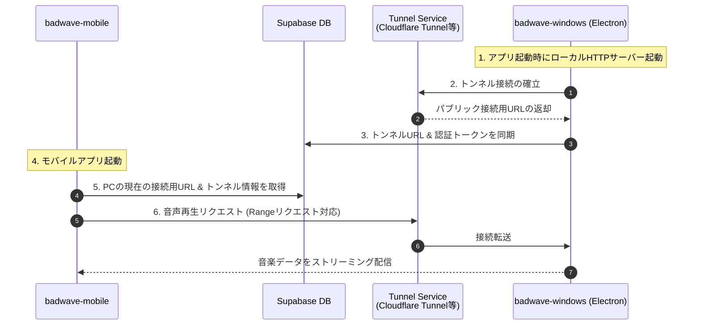

# PCローカル楽曲のリモート再生機能 設計仕様書

PC（`badwave-windows`）に保存されているローカルの音楽ファイルを、外出先のモバイル（`badwave-mobile`）からセキュアにリモート再生（ストリーミング）するための設計仕様です。本機能では、クラウドストレージ（Supabase Storage等）へ音楽ファイルをアップロードすることなく、PCから直接モバイルへ配信します。

---

## 1. 全体アーキテクチャ

本機能は、PC側で起動するストリーミングサーバー、外部からPCへアクセスするためのセキュアなトンネル接続、およびそれらの情報を仲介する同期機構で構成されます。



---

## 2. PC側（`badwave-windows`）の設計

### ① 軽量HTTPストリーミングサーバーの構築

Electronメインプロセス起動時に、Node.jsのHTTPモジュール（または `fastify` 等の軽量ライブラリ）を使用して、ローカルサーバーを起動します。

- **動作仕様**:
  - ポート番号: 動的に空きポートを割り当て、または固定（例: `42000`）。
  - エンドポイント: `/stream/:songId`
    - **Rangeリクエスト（HTTP 206 Partial Content）対応**:
      - モバイル側のシーク操作やバッファリングをスムーズに行うため、リクエストヘッダーの `Range` に応じたファイルのバイナリ部分読み込みをサポートします。
    - **簡易トークン認証**:
      - 不正アクセス防止のため、起動ごとに動的生成されるワンタイムトークン、もしくは固定のユーザーAPIキーをクエリパラメータ（例: `?token=xxx`）で受け取り検証します。

### ② トンネリングサービスとの統合

外出先からのアクセス経路を確保するため、パブリックなSSL/TLSエンドポイントを自動構築します。

- **採用技術候補**: `Cloudflare Tunnel (cloudflared)`
  - ※ ngrokと異なり、無料枠での接続制限が緩く、広告画面の割り込みがないためストリーミングに適しています。
- **制御フロー**:
  - PCアプリ起動時に、Electronから `child_process` を用いて同梱した `cloudflared` バイナリを起動。
  - `cloudflared tunnel --url http://localhost:PORT` の標準出力を解析し、割り当てられたパブリックURL（`https://*.trycloudflare.com`）を取得。
  - アプリ終了時にトンネルプロセスを安全にキルする。

### ③ 接続先情報の同期

取得したトンネルURLと認証用トークンを、モバイル側が検知できるように同期します。

- **同期先**: Supabase Database（例: `profiles` テーブルのメタデータ列、または新規作成する `pc_connections` テーブル）
- **送信データ構造**:
  ```json
  {
    "user_id": "uuid",
    "pc_active": true,
    "tunnel_url": "https://xxxx.trycloudflare.com",
    "stream_token": "secure-dynamic-token-string",
    "updated_at": "timestamp"
  }
  ```

---

## 3. モバイル側（`badwave-mobile`）の設計

### ① 接続情報の監視と取得

- PCの起動状態およびストリーミング先URLを、アプリ起動時やライブラリ画面読み込み時にSupabaseから取得します。
- PCが起動していない（あるいはトンネルURLが古い）場合は、リモート再生が不可である旨をユーザーにUIで明示します。

### ② プレイヤー（`TrackPlayer`）との連携

- PCからスキャンされた曲のメタデータ（PCローカル上の曲リスト）は、すでにDB同期されている前提とします。
- モバイル側で「PCローカル曲」を再生する際、`react-native-track-player` に渡すURLを以下のように解決します。
  ```typescript
  const streamUrl = `${pcConnection.tunnel_url}/stream/${song.id}?token=${pcConnection.stream_token}`;
  ```
- `TrackPlayer` はこのURLを通じて、Rangeリクエストによるシームレスなバッファリング再生を行います。

---

## 4. セキュリティと制限事項

1. **著作権と私的複製の範囲**:
   - 本システムはユーザー個人の所有するPCから、そのユーザー個人のモバイル端末へと音楽ファイルを直接転送（送信）するものであり、第三者への配信や一般公開は行いません。
   - 認証トークンにより、契約当事者以外の第三者からのアクセスを制限し、私的使用のための複製・送信の範囲を厳格に維持します。
2. **通信量とネットワーク負荷**:
   - 外出先からのモバイルデータ通信で高ビットレート（FLAC等）の曲を再生すると通信量が多くなるため、モバイルアプリ側で「WiFi接続時のみリモート再生を許可する」オプション、もしくはパケット節約用のキャッシュ機能を検討します。
3. **PCの電源状態**:
   - PCがシャットダウンしている、またはスリープ状態のときは再生できません。必要に応じて、PC側アプリ起動時にシステムの自動スリープを抑制する設定を有効化します。
