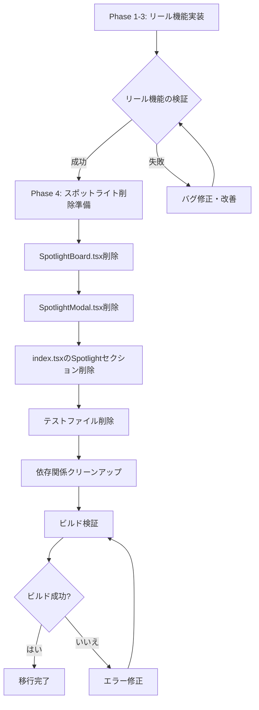
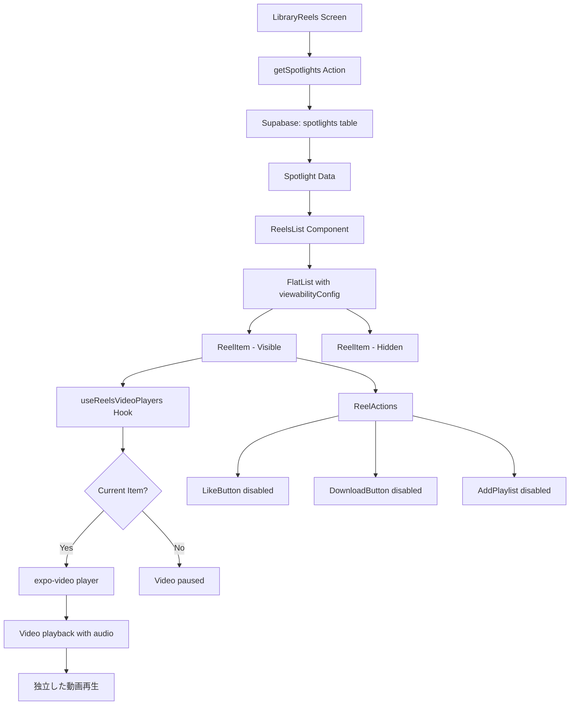
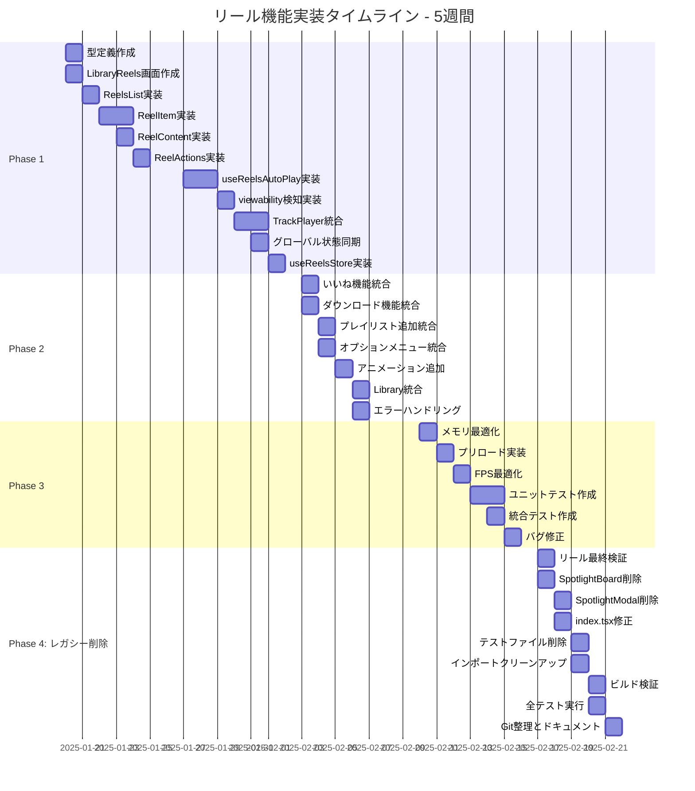
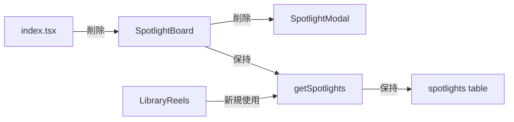

# リール動画機能実装計画

**badwave-mobile プロジェクト**

## エグゼクティブサマリー

### プロジェクト概要

badwave-mobile に、TikTok や Instagram リールのような**縦スクロール形式のショート動画プラットフォーム**機能を追加します。**既存の SpotlightBoard（横スクロール）を完全に置き換え**、アプリの**4 つ目の独立したタブ**（Home、Search、Library、**Reels**）として新設し、**動画とサウンドが融合した没入感のある音楽体験**を提供します。

### 主要な設計判断

- **再生方式**: **ショート動画再生**（expo-video の VideoView と useVideoPlayer を使用）
- **音楽再生**: 動画の音声トラックを再生（必要に応じて TrackPlayer と連携）
- **データソース**: 既存の`getSpotlights`アクションを再利用（動画 URL を含む）
- **配置**: **アプリ全体の 4 つ目の独立したタブとして追加**（Home、Search、Library、**Reels**）
- **実装方針**: 既存の SpotlightModal・SpotlightBoard の動画再生実装を活用し、縦スクロールに拡張
- **🔴 重要**: **既存のスポットライト機能を段階的に削除し、リール機能に完全移行**

### 移行戦略

本プロジェクトは、既存のスポットライト機能からリール機能への完全移行を含みます：

1. **フェーズ 1-3**: リール機能を実装（既存スポットライトと並行稼働）
2. **フェーズ 4**: リール機能の安定稼働を確認後、スポットライト機能を完全削除
3. **最終形態**: クリーンなコードベースで、リール機能のみが存在

### 期待される成果

- **ユーザーエンゲージメント向上**: 動画による没入感のある新しい音楽発見体験
- **セッション時間延長**: 縦スクロールによる連続再生で平均セッション時間**30%増**を目標
- **パフォーマンス維持**: 複数動画のプリロードでも**60fps**のスムーズなスクロールを実現
- **既存機能との統合**: いいね、ダウンロード、プレイリスト追加などの機能をシームレスに統合
- **コードベースの簡素化**: レガシーコードの削除により保守性が向上

---

## タブ構成の変更

### 現在のタブ構成（3 つのタブ）

```
┌─────────────────────────────────────────┐
│  ○ Home    ○ Search    ○ Library        │
└─────────────────────────────────────────┘
```

1. **Home タブ** (`app/(tabs)/index.tsx`)

   - HeroBoard
   - TrendBoard
   - ForYouBoard
   - SpotlightBoard ← **削除予定**
   - PlaylistBoard
   - Songs 一覧

2. **Search タブ** (`app/(tabs)/search.tsx`)

   - 曲の検索機能

3. **Library タブ** (`app/(tabs)/library.tsx`)
   - Liked Songs
   - Playlists
   - Downloads

### 新しいタブ構成（4 つのタブ）

```
┌─────────────────────────────────────────────────┐
│  ○ Home    ○ Search    ○ Library    ○ Reels    │
└─────────────────────────────────────────────────┘
```

1. **Home タブ** (`app/(tabs)/index.tsx`)

   - HeroBoard
   - TrendBoard
   - ForYouBoard
   - PlaylistBoard（SpotlightBoard 削除）
   - Songs 一覧

2. **Search タブ** (`app/(tabs)/search.tsx`)

   - 曲の検索機能

3. **Library タブ** (`app/(tabs)/library.tsx`)

   - Liked Songs
   - Playlists
   - Downloads

4. **🆕 Reels タブ** (`app/(tabs)/reels.tsx`) ← **新規追加**
   - 縦スクロール形式のショート動画プレイヤー
   - TikTok/Instagram リール風の UI
   - フルスクリーン動画再生
   - アクションボタン（いいね、ダウンロード等）

### タブ追加の理由

1. **独立した体験**: リール機能は没入感のある独立したコンテンツ消費体験を提供
2. **ナビゲーションの明確化**: ユーザーが簡単にリール機能にアクセス可能
3. **スケーラビリティ**: 将来的な機能拡張に対応しやすい構造
4. **既存機能との分離**: Library タブの複雑化を避け、シンプルな構造を維持

---

## 現状分析

### 削除対象のファイル・コンポーネント一覧

本プロジェクトでは、以下のスポットライト関連ファイルを**完全に削除**します：

#### 🗑️ 削除対象ファイル

1. **`components/board/SpotlightBoard.tsx`** (214 行)

   - 横スクロール形式のスポットライト表示
   - expo-av の Video コンポーネントを使用
   - Map 構造で videoRef を管理

2. **`components/modal/SpotlightModal.tsx`** (261 行)

   - フルスクリーン動画表示モーダル
   - expo-video の VideoView と useVideoPlayer を使用
   - react-native-reanimated でアニメーション実装

3. **`__tests__/components/board/SpotlightBoard.test.tsx`**

   - SpotlightBoard のユニットテスト

4. **`__tests__/components/modal/SpotlightModal.test.tsx`**
   - SpotlightModal のユニットテスト

#### ✏️ 変更対象ファイル

1. **`app/(tabs)/index.tsx`** (105-108 行目)

   - SpotlightBoard セクション全体を削除
   - インポート文の削除

2. **その他の依存ファイル**
   - SpotlightBoard や SpotlightModal をインポートしているファイル（もしあれば）

### 既存の Spotlight 機能（削除予定）

#### SpotlightBoard（横スクロール）

**ファイル**: [`components/board/SpotlightBoard.tsx`](components/board/SpotlightBoard.tsx:1-214)

**主要機能**:

- 横スクロールで複数の**ショート動画プレビュー**を表示
- プレスイン/アウトで**動画の再生/停止**
- タップでフルスクリーンモーダル表示
- ミュート/アンミュート機能

**技術実装**:

```typescript
// 主要な状態管理
const [isMuted, setIsMuted] = useState(true);
const [activeVideoIndex, setActiveVideoIndex] = useState(-1);
const videoRefsMap = useRef<Map<number, Video>>(new Map());

// expo-avのVideoコンポーネントを使用（動画再生）
<Video
  ref={(ref) => setVideoRef(ref, index)}
  source={{ uri: item.video_path }} // 動画URL
  isLooping
  shouldPlay={false}
  resizeMode={ResizeMode.COVER}
  isMuted={isMuted}
/>;
```

**最適化ポイント**:

- Map 構造で videoRef を効率的に管理
- 一度に 1 つの動画のみ再生（メモリ最適化）
- useCallback でハンドラーをメモ化
- 動画の自動 unload（メモリリーク防止）

#### SpotlightModal（フルスクリーン動画表示）

**ファイル**: [`components/modal/SpotlightModal.tsx`](components/modal/SpotlightModal.tsx)

**主要機能**:

- フルスクリーンで**ショート動画**を表示
- **expo-video**の`VideoView`と`useVideoPlayer`を使用
- スムーズなアニメーション（react-native-reanimated）
- タイトル・説明文の表示
- ミュート/アンミュートコントロール

**技術実装**:

```typescript
// expo-videoのuseVideoPlayerフックを使用（最新API）
const player = useVideoPlayer(item.video_path, (player) => {
  player.loop = true;
  player.play();
  player.muted = isMuted;
});

// VideoViewで動画を表示
<VideoView
  player={player}
  style={styles.video}
  contentFit="cover"
  nativeControls={false}
/>;

// Animated.Viewでスムーズな表示/非表示
const fadeAnim = useSharedValue(0);
fadeAnim.value = withTiming(1, { duration: 300 });
```

**重要な発見**:

- 既に**expo-video**による動画再生機能が実装済み
- `useVideoPlayer`でプレイヤーインスタンスを管理
- リール機能は、この実装を縦スクロールに拡張する形で実現可能

### データ構造

#### Spotlight 型定義

**ファイル**: [`types/index.ts`](types/index.ts:38-45)

```typescript
interface Spotlight {
  id: string;
  video_path: string;
  title: string;
  author: string;
  genre?: string;
  description?: string;
}
```

#### データ取得

**ファイル**: [`actions/getSpotlights.ts`](actions/getSpotlights.ts)

```typescript
const getSpotlights = async (): Promise<Spotlight[]> => {
  const { data, error } = await supabase
    .from("spotlights")
    .select("*")
    .order("created_at", { ascending: false });

  return (data as Spotlight[]) || [];
};
```

### 既存の TrackPlayer 統合（音楽再生用）

#### PlayerService

**ファイル**: [`services/PlayerService.ts`](services/PlayerService.ts)

**機能**:

- react-native-track-player の初期化
- バックグラウンド**音楽**再生のサポート
- メディアコントロール（再生、一時停止、次へ、前へ）
- 自動割り込み処理

**設定**:

```typescript
await TrackPlayer.setupPlayer({
  autoHandleInterruptions: true,
});

await TrackPlayer.updateOptions({
  capabilities: [
    Capability.Play,
    Capability.Pause,
    Capability.SkipToNext,
    Capability.SkipToPrevious,
    Capability.SeekTo,
  ],
});
```

**リール機能との関係**:

- **TrackPlayer**: 音楽トラックの再生用（既存機能）
- **expo-video**: ショート動画の再生用（リール機能）
- 両者は独立して動作し、状態管理で競合を回避

#### useAudioPlayer Hook

**ファイル**: [`hooks/useAudioPlayer.ts`](hooks/useAudioPlayer.ts)

**主要機能**:

- 再生/一時停止の切り替え
- キュー管理（updateQueueWithContext）
- シャッフル機能
- リピートモード設定
- 進捗管理

**リールモードでの使用**:

```typescript
// リールモードでは動画の音声を優先
// 必要に応じてTrackPlayerを一時停止
const { togglePlayPause, currentSong, isPlaying } = useAudioPlayer(
  songs,
  "reels" // コンテキストタイプ
);
```

### 強みと活用可能な資産

#### 強み 💪

1. **完成度の高い動画再生実装**: SpotlightModal と SpotlightBoard で既に expo-video を活用
2. **最適化されたメモリ管理**: Map 構造での videoRef 管理、自動 unload 実装済み
3. **最適化された TrackPlayer 統合**: 音楽再生のバックグラウンド対応完備
4. **包括的なテストカバレッジ**: TDD 実践で 58 のテストファイル
5. **既存の UI/UX パターン**: いいね、ダウンロード、プレイリスト追加のコンポーネント
6. **expo-video のプリロード知見**: 複数動画の事前読み込みパターンを活用可能

#### 活用可能な既存コンポーネント

- [`components/DownloadButton.tsx`](components/DownloadButton.tsx): 動画ダウンロード機能に拡張
- [`components/LikeButton.tsx`](components/LikeButton.tsx): いいね機能
- [`components/playlist/AddPlaylist.tsx`](components/playlist/AddPlaylist.tsx): プレイリスト追加
- [`components/item/ListItemOptionsMenu.tsx`](components/item/ListItemOptionsMenu.tsx): オプションメニュー
- [`components/modal/SpotlightModal.tsx`](components/modal/SpotlightModal.tsx): 動画再生ロジックを再利用

### 技術的課題

1. **縦スクロールの実装**: FlatList の設定とパフォーマンス最適化が必要
2. **複数動画のプリロード**: expo-video の useVideoPlayer で前後の動画を事前読み込み
3. **メモリ管理**: 多数の動画でもメモリリークを防ぐ（自動 unload）
4. **バッテリー消費**: 動画再生による電力消費の最適化
5. **データ使用量**: 動画ストリーミングの帯域幅管理
6. **既存プレイヤーとの競合**: TrackPlayer（音楽）と expo-video（動画）の共存
7. **スムーズなアニメーション**: 60fps を維持する最適化

---

## アーキテクチャ設計

### 移行戦略：スポットライトからリールへの完全移行

本プロジェクトは、段階的なアプローチで既存機能を新機能に置き換えます：

#### 移行フェーズ



#### フェーズ詳細

**フェーズ 1-3: リール機能実装（並行稼働期間）**

- 目的: リール機能を完全に実装し、安定稼働を確認
- 期間: 4 週間
- 状態: SpotlightBoard と Reels が両方存在
- リスク: 低（既存機能に影響なし）

**フェーズ 4: レガシー削除（完全移行期間）**

- 目的: スポットライト機能を完全に削除
- 期間: 1 週間
- 作業内容:
  1. SpotlightBoard.tsx の削除
  2. SpotlightModal.tsx の削除
  3. index.tsx からのインポート・セクション削除
  4. テストファイルの削除
  5. 未使用インポートのクリーンアップ
  6. ビルド検証
  7. 全テストの実行

#### ロールバック計画

万が一リール機能に重大な問題が発見された場合：

1. **Git 履歴の保持**

   ```bash
   # スポットライト削除前のコミット
   git tag spotlight-backup

   # 問題発生時のロールバック
   git revert <削除コミットのハッシュ>
   ```

2. **段階的復旧**

   - Step 1: SpotlightBoard を復元
   - Step 2: index.tsx のセクションを復元
   - Step 3: ビルド検証
   - Step 4: リール機能の問題を修正
   - Step 5: 再度削除を試行

3. **データ保全**
   - `spotlights`テーブルは削除しない（Reels で使用）
   - `getSpotlights`アクションも保持

---

## アーキテクチャ設計

### コンポーネント構造

```
app/(tabs)/reels.tsx (新規) - 4つ目の独立したタブ画面
  └─ ReelsList (新規) - FlatList ベース
       └─ ReelItem (新規) - 各リールアイテム
            ├─ ReelVideoBackground (新規) - 背景動画/画像
            ├─ ReelContent (新規) - タイトル、アーティスト情報
            └─ ReelActions (新規) - いいね、ダウンロードなど
```

### ファイル構成

```
badwave-mobile/
├── app/(tabs)/
│   └── reels.tsx                           # 新規: 4つ目のタブ画面
├── components/
│   └── reels/
│       ├── ReelsList.tsx                   # 新規: FlatListラッパー
│       ├── ReelItem.tsx                    # 新規: 個別リールアイテム
│       ├── ReelVideoBackground.tsx         # 新規: 背景動画/画像
│       ├── ReelContent.tsx                 # 新規: コンテンツ表示
│       └── ReelActions.tsx                 # 新規: アクションボタン群
├── hooks/
│   ├── useReelsVideoPlayers.ts             # 新規: リール動画プレイヤー管理
│   ├── useReelsScroll.ts                   # 新規: スクロール検知
│   └── useReelsAutoPlay.ts                 # 新規: 自動再生ロジック
├── types/
│   └── reels.ts                            # 新規: Reels型定義
└── __tests__/
    ├── app/
    │   └── reels.test.tsx                  # 新規: タブ画面テスト
    ├── components/
    │   └── reels/
    │       ├── ReelsList.test.tsx          # 新規
    │       ├── ReelItem.test.tsx           # 新規
    │       └── ReelActions.test.tsx        # 新規
    └── hooks/
        ├── useReelsVideoPlayers.test.ts    # 新規
        └── useReelsAutoPlay.test.ts        # 新規
```

### データフロー



**重要な変更点**:

- Spotlight 型を直接使用（変換ステップなし）
- expo-video で動画を直接再生
- TrackPlayer とは独立して動作
- グローバルプレイヤー状態への同期は不要

### 状態管理戦略

#### ローカル状態（React State）

```typescript
// LibraryReels.tsx
const [currentIndex, setCurrentIndex] = useState(0);
const [isPlaying, setIsPlaying] = useState(false);
const [reelsData, setReelsData] = useState<Spotlight[]>([]);
```

#### グローバル状態（Zustand）

既存の useAudioStore、usePlayerStore を活用:

```typescript
// 既存ストアの活用
const currentSong = useAudioStore((state) => state.currentSong);
const setCurrentSong = useAudioStore((state) => state.setCurrentSong);
const showPlayer = usePlayerStore((state) => state.showPlayer);
```

#### リール専用状態管理

```typescript
// hooks/useReelsStore.ts (新規)
import { create } from "zustand";
import { Spotlight } from "@/types";

interface ReelsState {
  currentReelIndex: number;
  isReelsMode: boolean;
  reelsQueue: Spotlight[]; // Spotlight型を直接使用（変換不要）
  setCurrentReelIndex: (index: number) => void;
  setIsReelsMode: (mode: boolean) => void;
  setReelsQueue: (queue: Spotlight[]) => void;
}

export const useReelsStore = create<ReelsState>((set) => ({
  currentReelIndex: 0,
  isReelsMode: false,
  reelsQueue: [], // Spotlightデータをそのまま保存
  setCurrentReelIndex: (index) => set({ currentReelIndex: index }),
  setIsReelsMode: (mode) => set({ isReelsMode: mode }),
  setReelsQueue: (queue) => set({ reelsQueue: queue }), // 変換なしで保存
}));
```

**設計のポイント**:

- `reelsQueue`は**Spotlight[]型**（Song[]ではない）
- データ変換は一切不要
- シンプルで直感的な状態管理

---

## UI/UX 設計

### リール画面レイアウト

#### 画面構成（動画フルスクリーン）

```
┌─────────────────────────────┐
│  ← Back    Reels    ︙       │ ← ヘッダー
├─────────────────────────────┤
│                             │
│     [Short Video]           │ ← 動画（フルスクリーン）
│      Playing...             │   縦向き 9:16
│                             │
│                             │   🔊/🔇 ミュート
│                             │
│  ┌───────────────────┐      │
│  │ Artist Name       │      │ ← コンテンツ情報
│  │ Song Title        │      │   （下部）
│  │ #Genre           │      │
│  └───────────────────┘      │
│                        ❤️   │ ← アクションボタン
│                        ⬇️   │   （右側）
│                        ➕   │
│                        ⋯   │
└─────────────────────────────┘
```

**重要な変更点**:

- 背景は**動画**（Album Art ではない）
- ミュート/アンミュートボタンを追加
- 動画の自動ループ再生
- 縦向き最適化（9:16 アスペクト比）

#### アクションボタン配置

**右側縦並び**（画面右側に配置）:

1. **いいねボタン** (❤️): [`LikeButton.tsx`](components/LikeButton.tsx)
2. **ダウンロードボタン** (⬇️): [`DownloadButton.tsx`](components/DownloadButton.tsx)
3. **プレイリスト追加** (➕): [`AddPlaylist.tsx`](components/playlist/AddPlaylist.tsx)
4. **オプションメニュー** (⋯): [`ListItemOptionsMenu.tsx`](components/item/ListItemOptionsMenu.tsx)

**🔴 重要な制約事項（Phase 1）**:

スポットライト用の DB スキーマが未作成のため、Phase 1 では**すべてのアクションボタンは飾りボタン（非機能）**として実装されます。

- ✅ ボタンのビジュアルは表示される
- ❌ タップしても何も起きない（`disabled={true}`）
- ❌ いいね数などのカウンターは表示されない（または 0 固定）
- 🔮 将来的に DB スキーマ追加後に機能実装予定

**理由**:

- `spotlights_likes` テーブル未作成
- `spotlights_downloads` メタデータ未作成
- `spotlights_playlists` 関連テーブル未作成

#### 段階的な機能実装計画

**Phase 1: 飾りボタン実装**（本プロジェクト）

```typescript
// ボタンのビジュアルのみ実装
<TouchableOpacity
  disabled={true} // 機能無効化
  style={styles.actionButton}
>
  <Ionicons name="heart-outline" size={32} color="#fff" />
  <Text style={styles.actionText}>0</Text>
</TouchableOpacity>
```

**Phase 2（将来）: DB スキーマ追加**

- `spotlights_likes` テーブル作成
- `spotlights_downloads` メタデータカラム追加
- `spotlights_playlists` 関連テーブル作成

**Phase 3（将来）: 機能実装**

- いいね機能の実装とテスト
- ダウンロード機能の実装とテスト
- プレイリスト追加機能の実装とテスト
- 既存機能との統合テスト

### ユーザーインタラクション

#### スワイプジェスチャー

1. **上スワイプ**: 次の動画へ
2. **下スワイプ**: 前の動画へ
3. **タップ**: 動画の再生/一時停止

#### 自動再生ロジック

```typescript
// viewabilityConfigの設定
const viewabilityConfig = {
  itemVisiblePercentThreshold: 80, // 80%表示で自動再生
  minimumViewTime: 300, // 300ms表示で判定
};

// onViewableItemsChangedコールバック
const onViewableItemsChanged = useCallback(({ viewableItems }) => {
  if (viewableItems.length > 0) {
    const visibleItem = viewableItems[0];
    setCurrentIndex(visibleItem.index);
    playReelAtIndex(visibleItem.index);
  }
}, []);
```

### アニメーション仕様

#### 画面遷移

```typescript
// react-native-reanimatedを使用
const fadeAnim = useSharedValue(0);

useEffect(() => {
  fadeAnim.value = withTiming(1, {
    duration: 300,
    easing: Easing.out(Easing.cubic),
  });
}, []);
```

#### スクロールアニメーション

```typescript
// スクロール時のパララックス効果
const scrollY = useSharedValue(0);

const animatedStyle = useAnimatedStyle(() => {
  return {
    transform: [
      {
        translateY: interpolate(
          scrollY.value,
          [0, SCREEN_HEIGHT],
          [0, -50],
          Extrapolation.CLAMP
        ),
      },
    ],
  };
});
```

### 既存プレイヤーとの連携

#### ミニプレイヤーとの共存

```typescript
// リールモード中はミニプレイヤーを非表示
useEffect(() => {
  if (isReelsMode) {
    setShowPlayer(false); // 既存のusePlayerStore
  }

  return () => {
    setShowPlayer(true); // 離脱時に復元
  };
}, [isReelsMode]);
```

#### グローバルプレイヤー状態の同期

```typescript
// リール動画は独立して再生（動画の音声トラック）
// グローバルプレイヤーとは分離して管理
useEffect(() => {
  if (isReelsMode) {
    // リールモード中はTrackPlayerを一時停止
    TrackPlayer.pause();
    setShowPlayer(false);
  }

  return () => {
    // リールモードを離れる時にプレイヤーを復元
    setShowPlayer(true);
  };
}, [isReelsMode]);
```

---

## 技術仕様

### 動画再生アーキテクチャ

#### expo-video 統合戦略

**選択理由**:

- ✅ 既に SpotlightModal で実装済み（知見あり）
- ✅ useVideoPlayer フックで複数プレイヤーの管理が容易
- ✅ プリロード機能が標準サポート
- ✅ バックグラウンド再生・PiP 対応可能
- ✅ React Native 新アーキテクチャ対応

**expo-av との比較**:

- expo-av: SpotlightBoard で使用中（横スクロール用）
- expo-video: SpotlightModal で使用中（フルスクリーン用）
- **推奨**: リール機能では**expo-video**を使用（最新 API、パフォーマンス優位）

#### 複数動画のプリロード実装

expo-video の`useVideoPlayer`を活用した効率的なプリロード戦略：

```typescript
// hooks/useReelsVideoPlayers.ts
import { useVideoPlayer } from "expo-video";
import { useMemo, useEffect } from "react";
import { Spotlight } from "@/types";

interface UseReelsVideoPlayersProps {
  reelsData: Spotlight[];
  currentIndex: number;
  preloadRange?: number; // デフォルト: 2（前後2つ）
}

export function useReelsVideoPlayers({
  reelsData,
  currentIndex,
  preloadRange = 2,
}: UseReelsVideoPlayersProps) {
  // プリロード対象のインデックス範囲を計算
  const preloadIndices = useMemo(() => {
    const indices: number[] = [];
    for (let i = -preloadRange; i <= preloadRange; i++) {
      const index = currentIndex + i;
      if (index >= 0 && index < reelsData.length) {
        indices.push(index);
      }
    }
    return indices;
  }, [currentIndex, preloadRange, reelsData.length]);

  // 各動画のプレイヤーを作成（プリロード）
  const players = useMemo(() => {
    const playerMap = new Map();

    preloadIndices.forEach((index) => {
      const reel = reelsData[index];
      if (reel) {
        // useVideoPlayerはコンポーネント外で使用不可のため、
        // 実際の実装ではReelItemコンポーネント内で管理
        playerMap.set(index, reel.video_path);
      }
    });

    return playerMap;
  }, [preloadIndices, reelsData]);

  return { preloadIndices, players };
}
```

**実装パターン（expo-video 公式例を参考）**:

```typescript
// ReelItem.tsx内での実装
function ReelItem({ reel, index, isActive, isPreload }: ReelItemProps) {
  // 現在のアイテムまたはプリロード対象のプレイヤーを作成
  const player = useVideoPlayer(reel.video_path, (player) => {
    player.loop = true;

    if (isActive) {
      // アクティブなリールは自動再生
      player.play();
    } else if (isPreload) {
      // プリロード対象は一時停止状態でバッファリング
      player.pause();
      // バッファリングは自動的に開始される
    }
  });

  useEffect(() => {
    if (isActive) {
      player.play();
    } else {
      player.pause();
    }
  }, [isActive, player]);

  // クリーンアップ
  useEffect(() => {
    return () => {
      // プレイヤーは自動的にクリーンアップされる
    };
  }, []);

  if (!isActive && !isPreload) {
    // プリロード範囲外は軽量なプレースホルダー
    return <View style={styles.placeholder} />;
  }

  return (
    <View style={styles.container}>
      <VideoView
        player={player}
        style={styles.video}
        contentFit="cover"
        nativeControls={false}
      />
      {/* その他のUI要素 */}
    </View>
  );
}
```

### FlatList ベース実装（推奨）

#### メリット

✅ **React Native 公式コンポーネント**: 安定性と信頼性が高い
✅ **最適化済みの仮想化**: 大量データでもメモリ効率的
✅ **豊富な API**: viewabilityConfig、onEndReached など
✅ **既存実装の知見**: プロジェクト内で多用されている
✅ **テスト容易性**: モック化とテストが簡単
✅ **動画プリロードとの相性**: windowSize でプリロード範囲を制御

#### デメリット

❌ スクロール制御の自由度が若干低い
❌ 高度なアニメーションには追加実装が必要

#### 実装例（動画プリロード対応）

```typescript
// app/(tabs)/reels.tsx - 4つ目の独立したタブ画面
import React, { useCallback, useRef, useState } from "react";
import { FlatList, Dimensions, StyleSheet } from "react-native";
import { useQuery } from "@tanstack/react-query";
import getSpotlights from "@/actions/getSpotlights";
import { CACHED_QUERIES } from "@/constants";
import ReelItem from "@/components/reels/ReelItem";
import Loading from "@/components/common/Loading";
import Error from "@/components/common/Error";

const { height: SCREEN_HEIGHT } = Dimensions.get("window");

export default function ReelsScreen() {
  const [currentIndex, setCurrentIndex] = useState(0);
  const flatListRef = useRef<FlatList>(null);

  const {
    data: reelsData = [],
    isLoading,
    error,
  } = useQuery({
    queryKey: [CACHED_QUERIES.spotlights],
    queryFn: getSpotlights,
  });

  // viewability設定
  const viewabilityConfig = useRef({
    itemVisiblePercentThreshold: 80,
    minimumViewTime: 300,
  }).current;

  // 表示中のアイテムが変更された時
  const onViewableItemsChanged = useRef(({ viewableItems }) => {
    if (viewableItems.length > 0) {
      const index = viewableItems[0].index ?? 0;
      setCurrentIndex(index);
    }
  }).current;

  // プリロード範囲の計算
  const isInPreloadRange = useCallback(
    (index: number) => {
      return Math.abs(index - currentIndex) <= 2; // 前後2つ
    },
    [currentIndex]
  );

  // アイテムレンダリング（プリロード対応）
  // item は Spotlight 型（変換不要）
  const renderItem = useCallback(
    ({ item, index }) => (
      <ReelItem
        reel={item} // Spotlight型をそのまま渡す
        index={index}
        isActive={index === currentIndex}
        isPreload={isInPreloadRange(index)}
      />
    ),
    [currentIndex, isInPreloadRange]
  );

  // キー抽出
  const keyExtractor = useCallback((item) => item.id, []);

  // アイテムレイアウト（パフォーマンス最適化）
  const getItemLayout = useCallback(
    (data, index) => ({
      length: SCREEN_HEIGHT,
      offset: SCREEN_HEIGHT * index,
      index,
    }),
    []
  );

  if (isLoading) return <Loading />;
  if (error) return <Error message={error.message} />;

  return (
    <FlatList
      ref={flatListRef}
      data={reelsData}
      renderItem={renderItem}
      keyExtractor={keyExtractor}
      getItemLayout={getItemLayout}
      pagingEnabled
      decelerationRate="fast"
      snapToInterval={SCREEN_HEIGHT}
      snapToAlignment="start"
      showsVerticalScrollIndicator={false}
      viewabilityConfig={viewabilityConfig}
      onViewableItemsChanged={onViewableItemsChanged}
      removeClippedSubviews
      maxToRenderPerBatch={2} // 動画は重いので2に制限
      windowSize={5} // 前後2.5画面分を保持（プリロード範囲）
      initialNumToRender={1} // 初回は1つのみ
      style={styles.container}
    />
  );
}

const styles = StyleSheet.create({
  container: {
    flex: 1,
    backgroundColor: "#000",
  },
});
```

### 自動再生の実装

#### useReelsVideoPlayers Hook

**重要な設計判断**: リール機能では**動画の音声トラックを直接再生**します。Spotlight 型を Song 型に変換する必要はありません。

```typescript
// hooks/useReelsVideoPlayers.ts
import { useEffect, useRef } from "react";
import { useVideoPlayer } from "expo-video";
import { Spotlight } from "@/types";

interface UseReelsVideoPlayersProps {
  currentIndex: number;
  reelsData: Spotlight[];
  isActive: boolean; // 画面がアクティブか
}

/**
 * リール動画の自動再生を管理するフック
 * expo-videoのuseVideoPlayerを使用して動画を直接再生
 * Spotlightデータをそのまま使用（変換不要）
 */
export function useReelsVideoPlayers({
  currentIndex,
  reelsData,
  isActive,
}: UseReelsVideoPlayersProps) {
  const previousIndexRef = useRef<number>(-1);
  const currentReel = reelsData[currentIndex];

  // 現在のリールの動画プレイヤーを作成
  const player = useVideoPlayer(currentReel?.video_path, (player) => {
    player.loop = true;
    player.muted = false; // 動画の音声を再生

    if (isActive && currentIndex !== previousIndexRef.current) {
      player.play();
      previousIndexRef.current = currentIndex;
    }
  });

  useEffect(() => {
    // インデックスが変更されたら動画を再生
    if (isActive && currentIndex !== previousIndexRef.current) {
      player.play();
      previousIndexRef.current = currentIndex;
    } else if (!isActive) {
      player.pause();
    }
  }, [currentIndex, isActive, player]);

  // クリーンアップ: 画面を離れる時に動画を停止
  useEffect(() => {
    return () => {
      player.pause();
    };
  }, [player]);

  return {
    player,
    currentReel,
  };
}
```

**変換が不要な理由**:

1. **動画の音声トラックを直接再生**: リールは動画コンテンツなので、`video_path`の音声を再生すれば十分
2. **型の不一致**: Spotlight と Song は全く異なる構造（必須フィールドが異なる）
3. **シンプルな実装**: 変換なしで直接`spotlight.video_path`を使用
4. **パフォーマンス向上**: 不要な変換処理がないため高速
5. **バグの削減**: 型の無理な変換によるバグを防止

**実装のメリット**:

```typescript
// ❌ 変換あり（不要な複雑さ）
const song = convertSpotlightToSong(spotlight);
player.load(song.song_path); // 実際はvideo_pathと同じ

// ✅ 変換なし（シンプル）
player.load(spotlight.video_path); // 直接使用
```

### ReelItem コンポーネント

#### Phase 1: 飾りボタン版の実装

**重要な設計判断**: ReelItem は**Spotlight 型を直接受け取ります**。Song 型への変換は不要です。

```typescript
// components/reels/ReelItem.tsx
import React, { memo } from "react";
import {
  View,
  StyleSheet,
  Dimensions,
  ImageBackground,
  TouchableOpacity,
  Text,
} from "react-native";
import { Ionicons } from "@expo/vector-icons";
import { Spotlight } from "@/types";
import ReelContent from "./ReelContent";
import { LinearGradient } from "expo-linear-gradient";

const { width: SCREEN_WIDTH, height: SCREEN_HEIGHT } = Dimensions.get("window");

/**
 * ReelItemのProps
 * @property reel - Spotlight型のリールデータ（変換不要）
 * @property index - FlatList内のインデックス
 * @property isActive - 現在表示中かどうか
 */
interface ReelItemProps {
  reel: Spotlight; // Song型ではなく、Spotlight型を直接使用
  index: number;
  isActive: boolean;
}

function ReelItem({ reel, index, isActive }: ReelItemProps) {
  return (
    <View style={styles.container}>
      {/* 背景画像/動画 */}
      <ImageBackground
        source={{ uri: reel.video_path }}
        style={styles.background}
        resizeMode="cover"
      >
        {/* グラデーションオーバーレイ */}
        <LinearGradient
          colors={["transparent", "rgba(0,0,0,0.3)", "rgba(0,0,0,0.8)"]}
          style={styles.gradient}
        />

        {/* コンテンツエリア */}
        <View style={styles.contentContainer}>
          <ReelContent reel={reel} isActive={isActive} />
        </View>

        {/* アクションボタン（Phase 1: 飾りボタン） */}
        <View style={styles.actionsContainer}>
          {/* いいねボタン - 現時点では非機能 */}
          <TouchableOpacity
            style={styles.actionButton}
            disabled={true} // 機能無効化
            onPress={() => {}}
          >
            <Ionicons name="heart-outline" size={32} color="#fff" />
            <Text style={styles.actionText}>0</Text>
          </TouchableOpacity>

          {/* ダウンロードボタン - 現時点では非機能 */}
          <TouchableOpacity
            style={styles.actionButton}
            disabled={true}
            onPress={() => {}}
          >
            <Ionicons name="download-outline" size={32} color="#fff" />
          </TouchableOpacity>

          {/* プレイリスト追加 - 現時点では非機能 */}
          <TouchableOpacity
            style={styles.actionButton}
            disabled={true}
            onPress={() => {}}
          >
            <Ionicons name="add-circle-outline" size={32} color="#fff" />
          </TouchableOpacity>

          {/* オプションメニュー - 現時点では非機能 */}
          <TouchableOpacity
            style={styles.actionButton}
            disabled={true}
            onPress={() => {}}
          >
            <Ionicons name="ellipsis-vertical" size={32} color="#fff" />
          </TouchableOpacity>
        </View>
      </ImageBackground>
    </View>
  );
}

const styles = StyleSheet.create({
  container: {
    width: SCREEN_WIDTH,
    height: SCREEN_HEIGHT,
  },
  background: {
    flex: 1,
    justifyContent: "flex-end",
  },
  gradient: {
    position: "absolute",
    left: 0,
    right: 0,
    bottom: 0,
    height: SCREEN_HEIGHT * 0.5,
  },
  contentContainer: {
    position: "absolute",
    bottom: 100,
    left: 20,
    right: 80,
  },
  actionsContainer: {
    position: "absolute",
    right: 16,
    bottom: 100,
    gap: 24, // ボタン間のスペース
  },
  actionButton: {
    alignItems: "center",
    justifyContent: "center",
    opacity: 0.6, // 非アクティブ状態を視覚的に表現
  },
  actionText: {
    color: "#fff",
    fontSize: 12,
    marginTop: 4,
  },
});

export default memo(ReelItem);
```

**重要な実装ポイント**:

- `disabled={true}`: すべてのボタンを無効化
- `opacity: 0.6`: 非アクティブ状態を視覚的に表現
- `onPress={() => {}}`: 空の関数（将来の実装に備える）
- いいね数は `0` で固定表示

### パフォーマンス最適化

#### メモリ管理

```typescript
// FlatList最適化プロップス
<FlatList
  // レンダリング最適化
  removeClippedSubviews={true} // 画面外の要素を削除
  maxToRenderPerBatch={3} // 一度に描画する最大数
  windowSize={5} // 保持するアイテム数（5 * 画面高さ）
  initialNumToRender={2} // 初回レンダリング数
  // スクロール最適化
  decelerationRate="fast" // 素早い減速
  snapToInterval={SCREEN_HEIGHT} // スナップ位置
  // パフォーマンス計測
  onScrollBeginDrag={() => {
    console.log("Scroll started");
  }}
  onScrollEndDrag={() => {
    console.log("Scroll ended");
  }}
/>
```

#### プリロード戦略

```typescript
// hooks/useReelsPreload.ts
import { useEffect } from "react";
import { Image } from "react-native";

export function useReelsPreload(reelsData: Spotlight[], currentIndex: number) {
  useEffect(() => {
    // 現在のアイテムの前後2つをプリロード
    const preloadRange = [-2, -1, 0, 1, 2];

    preloadRange.forEach((offset) => {
      const index = currentIndex + offset;
      if (index >= 0 && index < reelsData.length) {
        const reel = reelsData[index];
        // 画像をプリロード
        Image.prefetch(reel.video_path);
      }
    });
  }, [currentIndex, reelsData]);
}
```

### タブレイアウトへの統合

#### app/(tabs)/\_layout.tsx への追加

```typescript
// app/(tabs)/_layout.tsx
export default function TabLayout() {
  const showPlayer = usePlayerStore((state) => state.showPlayer);
  const showHeader = useHeaderStore((state) => state.showHeader);
  const currentSong = useAudioStore((state) => state.currentSong);

  return (
    <>
      {showHeader && <Header />}
      <Tabs
        screenOptions={
          {
            // ...既存の設定...
          }
        }
      >
        {/* 既存の3つのタブ */}
        <Tabs.Screen
          name="index"
          options={
            {
              /* Home */
            }
          }
        />
        <Tabs.Screen
          name="search"
          options={
            {
              /* Search */
            }
          }
        />
        <Tabs.Screen
          name="library"
          options={
            {
              /* Library */
            }
          }
        />

        {/* 🆕 4つ目のタブとしてReelsを追加 */}
        <Tabs.Screen
          name="reels"
          options={{
            headerShown: false,
            tabBarIcon: ({ focused }) => (
              <View style={styles.iconContainer}>
                <MaterialCommunityIcons
                  name="movie-open-play"
                  size={24}
                  color={focused ? "#4c1d95" : "#666"}
                  style={
                    focused
                      ? {
                          textShadowColor: "#4c1d95",
                          textShadowOffset: { width: 0, height: 0 },
                          textShadowRadius: 20,
                          shadowColor: "#6d28d9",
                          shadowOffset: { width: 0, height: 0 },
                          shadowRadius: 20,
                          shadowOpacity: 0.8,
                        }
                      : {}
                  }
                />
              </View>
            ),
          }}
        />

        {/* その他の非表示ルート */}
        <Tabs.Screen name="genre/[genre]" options={{ href: null }} />
        <Tabs.Screen name="playlist/[playlistId]" options={{ href: null }} />
        <Tabs.Screen name="song/[songId]" options={{ href: null }} />
      </Tabs>
      <PlayerContainer />
    </>
  );
}
```

---

## テスト戦略（TDD 準拠）

### ユニットテスト

#### 1. LibraryReels Screen

**ファイル**: `__tests__/screens/LibraryReels.test.tsx`

```typescript
import { render, waitFor } from "@testing-library/react-native";
import LibraryReels from "@/screens/LibraryReels";
import { QueryClient, QueryClientProvider } from "@tanstack/react-query";

const mockReelsData = [
  {
    id: "1",
    title: "Test Song 1",
    author: "Artist 1",
    video_path: "https://example.com/video1.mp4",
    genre: "Electronic",
  },
  // ...more test data
];

jest.mock("@/actions/getSpotlights", () => ({
  __esModule: true,
  default: jest.fn(() => Promise.resolve(mockReelsData)),
}));

describe("ReelsScreen - 4つ目のタブ画面", () => {
  it("リールデータを正しく表示すること", async () => {
    const queryClient = new QueryClient();
    const { getByTestId } = render(
      <QueryClientProvider client={queryClient}>
        <ReelsScreen />
      </QueryClientProvider>
    );

    await waitFor(() => {
      expect(getByTestId("reels-list")).toBeTruthy();
    });
  });

  it("ローディング中はLoading componentを表示すること", () => {
    // テスト実装
  });

  it("エラー時はError componentを表示すること", () => {
    // テスト実装
  });
});
```

#### 2. useReelsAutoPlay Hook

**ファイル**: `__tests__/hooks/useReelsAutoPlay.test.ts`

```typescript
import { renderHook, act } from "@testing-library/react-hooks";
import { useReelsAutoPlay } from "@/hooks/useReelsAutoPlay";

describe("useReelsAutoPlay", () => {
  it("currentIndexが変更されたら自動的に再生すること", () => {
    const { result, rerender } = renderHook(
      ({ currentIndex }) =>
        useReelsAutoPlay({
          currentIndex,
          reelsData: mockReelsData,
          isActive: true,
        }),
      {
        initialProps: { currentIndex: 0 },
      }
    );

    // インデックス変更
    rerender({ currentIndex: 1 });

    // 再生が開始されることを確認
    expect(result.current.isPlaying).toBe(true);
  });

  it("isActiveがfalseの場合は自動再生しないこと", () => {
    // テスト実装
  });

  it("クリーンアップ時に再生を停止すること", () => {
    // テスト実装
  });
});
```

#### 3. ReelItem Component

**ファイル**: `__tests__/components/reels/ReelItem.test.tsx`

```typescript
import { render } from "@testing-library/react-native";
import ReelItem from "@/components/reels/ReelItem";

describe("ReelItem Component", () => {
  const mockReel = {
    id: "1",
    title: "Test Song",
    author: "Test Artist",
    video_path: "https://example.com/video.mp4",
  };

  it("リール情報を正しく表示すること", () => {
    const { getByText } = render(
      <ReelItem reel={mockReel} index={0} isActive={true} />
    );

    expect(getByText("Test Song")).toBeTruthy();
    expect(getByText("Test Artist")).toBeTruthy();
  });

  it("isActiveがtrueの時のみアクティブスタイルを適用すること", () => {
    // テスト実装
  });

  it("メモ化により不要な再レンダリングを防ぐこと", () => {
    // テスト実装
  });
});
```

### 統合テスト

#### リール再生フロー

**ファイル**: `__tests__/integration/reels-playback.test.tsx`

```typescript
describe("Reels Playback Integration", () => {
  it("リールをスクロールすると自動的に次の動画が再生されること", async () => {
    // 1. Reelsタブを表示
    // 2. 下にスクロール
    // 3. 次のリールが表示される
    // 4. 動画が自動再生される
    // 5. currentReelIndexが更新される
  });

  it("リールタブから他のタブに移動した時に動画が停止されること", async () => {
    // 1. Reelsタブで動画を再生
    // 2. Homeタブに移動
    // 3. 動画が停止される
    // 4. TrackPlayerの状態が復元される
  });

  it("他のタブからReelsタブに戻った時に正しく再開されること", async () => {
    // 1. Homeタブから開始
    // 2. Reelsタブに移動
    // 3. 動画が自動再生される
    // 4. TrackPlayerが一時停止される
  });
});
```

### パフォーマンステスト

```typescript
describe("Reels Performance", () => {
  it("100個のリールをスクロールしてもメモリリークが発生しないこと", async () => {
    // メモリ使用量を測定
    const initialMemory = getMemoryUsage();

    // 100個のリールをスクロール
    for (let i = 0; i < 100; i++) {
      await scrollToIndex(i);
    }

    const finalMemory = getMemoryUsage();
    const memoryIncrease = finalMemory - initialMemory;

    // メモリ増加が許容範囲内であることを確認
    expect(memoryIncrease).toBeLessThan(50 * 1024 * 1024); // 50MB以内
  });

  it("スクロール時に60fpsを維持すること", async () => {
    // FPS測定ロジック
  });
});
```

### テストカバレッジ目標

- **ユニットテスト**: 85%以上
- **統合テスト**: 主要フロー 100%カバー
- **E2E テスト**: クリティカルパス 100%カバー

---

## 実装計画

### 全体概要

**総期間**: 5 週間（4 週間の実装 + 1 週間のレガシー削除）
**アプローチ**: 段階的実装と段階的削除

### フェーズ 1: 基礎実装と動画再生（1-2 週間）

#### Week 1: コンポーネント基盤と動画再生

| タスク                                     | 工数   | 担当 | 完了条件                        |
| ------------------------------------------ | ------ | ---- | ------------------------------- |
| 型定義作成                                 | 0.5 日 | -    | types/reels.ts 完成             |
| **expo-video 統合調査**                    | 0.5 日 | -    | プリロード方式確認              |
| **app/(tabs)/reels.tsx 画面作成**          | 1 日   | -    | 4 つ目のタブ基本レイアウト表示  |
| **\_layout.tsx に Reels タブ追加**         | 0.5 日 | -    | タブナビゲーション設定完了      |
| ReelsList 実装                             | 1 日   | -    | FlatList 設定完了               |
| **ReelItem 動画再生実装**                  | 2 日   | -    | expo-video 統合、プリロード     |
| ReelContent 実装                           | 0.5 日 | -    | 情報表示 UI                     |
| **アクションボタン UI 実装（飾りボタン）** | 0.5 日 | -    | 4 つのボタン表示、disabled 状態 |

**成果物**:

- [ ] 基本的なリール表示画面
- [ ] 縦スクロール機能
- [ ] **動画の自動再生・プリロード**
- [ ] 動画情報の表示
- [ ] **アクションボタン UI（非機能、飾りのみ）**

#### Week 2: 動画制御と状態管理

| タスク                        | 工数   | 担当 | 完了条件                 |
| ----------------------------- | ------ | ---- | ------------------------ |
| **useReelsVideoPlayers 実装** | 1.5 日 | -    | 複数動画プレイヤー管理   |
| viewability 検知実装          | 1 日   | -    | スクロール検知動作       |
| **動画・音楽の排他制御**      | 1.5 日 | -    | TrackPlayer との競合回避 |
| グローバル状態同期            | 1 日   | -    | ミニプレイヤー連携       |
| useReelsStore 実装            | 0.5 日 | -    | リール専用状態管理       |
| **ミュート/アンミュート機能** | 0.5 日 | -    | 動画音声制御             |

**成果物**:

- [ ] スクロールで動画が自動再生
- [ ] 動画と音楽の排他制御
- [ ] 複数動画のプリロード
- [ ] グローバルプレイヤーとの連携

### フェーズ 2: 機能拡張と最適化（1 週間）

### アクションボタンのテスト（Phase 1: 飾りボタン）

#### Phase 1 用のテスト戦略

**ファイル**: `__tests__/screens/LibraryReels.test.tsx`

```typescript
describe("ReelsScreen - Action Buttons (Phase 1)", () => {
  it("should render all action buttons", () => {
    const { getByTestId } = render(<ReelsScreen />);

    // 4つのボタンが表示されることを確認
    expect(getByTestId("reel-like-button")).toBeTruthy();
    expect(getByTestId("reel-download-button")).toBeTruthy();
    expect(getByTestId("reel-playlist-button")).toBeTruthy();
    expect(getByTestId("reel-options-button")).toBeTruthy();
  });

  it("action buttons should be disabled", () => {
    const { getByTestId } = render(<ReelsScreen />);

    // すべてのボタンがdisabled状態であることを確認
    const likeButton = getByTestId("reel-like-button");
    const downloadButton = getByTestId("reel-download-button");
    const playlistButton = getByTestId("reel-playlist-button");
    const optionsButton = getByTestId("reel-options-button");

    expect(likeButton.props.disabled).toBe(true);
    expect(downloadButton.props.disabled).toBe(true);
    expect(playlistButton.props.disabled).toBe(true);
    expect(optionsButton.props.disabled).toBe(true);
  });

  it("should not trigger any action when buttons are pressed", () => {
    const mockOnPress = jest.fn();
    const { getByTestId } = render(<ReelsScreen />);

    // ボタンを押しても何も起きないことを確認
    fireEvent.press(getByTestId("reel-like-button"));
    fireEvent.press(getByTestId("reel-download-button"));
    fireEvent.press(getByTestId("reel-playlist-button"));
    fireEvent.press(getByTestId("reel-options-button"));

    expect(mockOnPress).not.toHaveBeenCalled();
  });

  it("buttons should have correct icons", () => {
    const { getByTestId } = render(<ReelsScreen />);

    // 各ボタンが正しいアイコンを持つことを確認
    const likeButton = getByTestId("reel-like-button");
    const downloadButton = getByTestId("reel-download-button");
    const playlistButton = getByTestId("reel-playlist-button");
    const optionsButton = getByTestId("reel-options-button");

    // Ioniconsの名前を確認
    expect(likeButton).toContainElement("heart-outline");
    expect(downloadButton).toContainElement("download-outline");
    expect(playlistButton).toContainElement("add-circle-outline");
    expect(optionsButton).toContainElement("ellipsis-vertical");
  });

  it("buttons should have reduced opacity for non-active state", () => {
    const { getByTestId } = render(<ReelsScreen />);

    const likeButton = getByTestId("reel-like-button");

    // 非アクティブ状態のopacityを確認
    expect(likeButton.props.style.opacity).toBe(0.6);
  });

  it("like button should display count as 0", () => {
    const { getByText } = render(<ReelsScreen />);

    // いいね数が0と表示されることを確認
    expect(getByText("0")).toBeTruthy();
  });
});
```

#### Phase 5（将来）用のテスト戦略

Phase 5 で DB スキーマ追加後に実装するテスト：

```typescript
describe("ReelsScreen - Action Buttons (Phase 5: Functional)", () => {
  it("should toggle like status when like button is pressed", async () => {
    // いいねボタンのトグル機能をテスト
  });

  it("should start download when download button is pressed", async () => {
    // ダウンロード機能をテスト
  });

  it("should show playlist selection when playlist button is pressed", async () => {
    // プレイリスト追加機能をテスト
  });

  it("should show options menu when options button is pressed", async () => {
    // オプションメニュー表示をテスト
  });

  it("should update like count in real-time", async () => {
    // いいね数のリアルタイム更新をテスト
  });

  it("should sync like status with other screens", async () => {
    // 他画面とのいいね状態同期をテスト
  });
});
```

#### Week 3: 追加機能とパフォーマンス最適化

| タスク                   | 工数   | 担当 | 完了条件                 |
| ------------------------ | ------ | ---- | ------------------------ |
| いいね機能統合           | 0.5 日 | -    | LikeButton 動作          |
| **動画ダウンロード機能** | 1 日   | -    | DownloadButton 拡張      |
| プレイリスト追加統合     | 0.5 日 | -    | AddPlaylist 動作         |
| オプションメニュー統合   | 0.5 日 | -    | メニュー表示             |
| **バッテリー最適化**     | 0.5 日 | -    | 低バッテリー時の品質調整 |
| **ネットワーク最適化**   | 0.5 日 | -    | WiFi/モバイルデータ対応  |
| アニメーション追加       | 1 日   | -    | スムーズな遷移           |
| **タブ間遷移の最適化**   | 0.5 日 | -    | タブ切り替え時の状態管理 |
| エラーハンドリング       | 0.5 日 | -    | 各種エラー対応           |

**成果物**:

- [ ] 全ての既存機能が動作
- [ ] 動画ダウンロード機能
- [ ] バッテリー・ネットワーク最適化
- [ ] スムーズなアニメーション
- [ ] Library タブに統合完了

### フェーズ 3: 最適化とテスト（1 週間）

#### Week 4: 動画パフォーマンスとテスト

| タスク                   | 工数   | 担当 | 完了条件               |
| ------------------------ | ------ | ---- | ---------------------- |
| **動画メモリ最適化**     | 1 日   | -    | メモリリークなし       |
| **動画プリロード最適化** | 1 日   | -    | スムーズなスクロール   |
| **低スペック端末対応**   | 0.5 日 | -    | デグラデーション実装   |
| FPS 最適化               | 0.5 日 | -    | 60fps 維持             |
| **動画再生テスト作成**   | 1 日   | -    | 動画プレイヤーのテスト |
| ユニットテスト作成       | 1 日   | -    | カバレッジ 85%以上     |
| 統合テスト作成           | 0.5 日 | -    | 主要フロー 100%        |
| バグ修正                 | 0.5 日 | -    | 既知のバグ解消         |

**成果物**:

- [ ] 動画パフォーマンス目標達成
- [ ] 低スペック端末対応
- [ ] 包括的なテストスイート（動画再生含む）
- [ ] プロダクション準備完了

### フェーズ 4: レガシー削除とクリーンアップ（1 週間）

#### Week 5: スポットライト機能の完全削除

| タスク                         | 工数   | 担当 | 完了条件                 |
| ------------------------------ | ------ | ---- | ------------------------ |
| **リール機能の最終検証**       | 0.5 日 | -    | 全機能が正常動作         |
| **SpotlightBoard.tsx 削除**    | 0.5 日 | -    | ファイル削除完了         |
| **SpotlightModal.tsx 削除**    | 0.5 日 | -    | ファイル削除完了         |
| **index.tsx の修正**           | 0.5 日 | -    | Spotlight セクション削除 |
| **テストファイル削除**         | 0.5 日 | -    | 関連テスト削除           |
| **インポート文クリーンアップ** | 0.5 日 | -    | 未使用インポート削除     |
| **ビルド検証**                 | 0.5 日 | -    | エラーなしでビルド成功   |
| **全テスト実行**               | 0.5 日 | -    | 全テストパス             |
| **Git 履歴の整理**             | 0.5 日 | -    | バックアップタグ作成     |
| **ドキュメント更新**           | 0.5 日 | -    | README 等の更新          |

**成果物**:

- [ ] SpotlightBoard.tsx 削除完了
- [ ] SpotlightModal.tsx 削除完了
- [ ] index.tsx から Spotlight セクション削除完了
- [ ] 関連テストファイル削除完了
- [ ] ビルドエラーなし
- [ ] 全テストパス
- [ ] クリーンなコードベース

**削除対象の詳細チェックリスト**:

```typescript
// 削除するファイル
✓ components/board/SpotlightBoard.tsx
✓ components/modal/SpotlightModal.tsx
✓ __tests__/components/board/SpotlightBoard.test.tsx
✓ __tests__/components/modal/SpotlightModal.test.tsx

// 修正するファイル（インポート文とセクション削除）
✓ app/(tabs)/index.tsx
  - import SpotlightBoard の削除
  - {renderSectionTitle("Spotlights", "flash")} の削除
  - <SpotlightBoard /> セクション全体の削除
```

### フェーズ 5: アクションボタン機能実装（将来・2-3 週間）

**前提条件**: DB スキーマの作成が完了していること

#### Week 1: DB スキーマ設計と実装

| タスク                                  | 工数   | 担当 | 完了条件             |
| --------------------------------------- | ------ | ---- | -------------------- |
| **spotlights_likes テーブル設計**       | 0.5 日 | -    | スキーマ設計完了     |
| **spotlights_likes テーブル作成**       | 0.5 日 | -    | マイグレーション実行 |
| **spotlights_downloads メタデータ追加** | 0.5 日 | -    | カラム追加完了       |
| **spotlights_playlists テーブル設計**   | 0.5 日 | -    | スキーマ設計完了     |
| **spotlights_playlists テーブル作成**   | 0.5 日 | -    | マイグレーション実行 |
| **DB 関係性の検証**                     | 0.5 日 | -    | 外部キー確認         |

**成果物**:

- [ ] spotlights_likes テーブル
- [ ] spotlights_downloads メタデータ
- [ ] spotlights_playlists テーブル
- [ ] DB マイグレーションスクリプト

#### Week 2: 機能実装

| タスク                         | 工数   | 担当 | 完了条件                      |
| ------------------------------ | ------ | ---- | ----------------------------- |
| **いいね機能実装**             | 1.5 日 | -    | いいね追加/削除、カウント表示 |
| **ダウンロード機能実装**       | 1.5 日 | -    | 動画ダウンロード、進捗表示    |
| **プレイリスト追加機能実装**   | 1.5 日 | -    | プレイリスト選択、追加        |
| **既存コンポーネントとの統合** | 0.5 日 | -    | LikeButton 等の再利用         |

**成果物**:

- [ ] 完全に機能するいいねボタン
- [ ] 完全に機能するダウンロードボタン
- [ ] 完全に機能するプレイリスト追加ボタン
- [ ] オプションメニュー統合

#### Week 3: テストと統合

| タスク                     | 工数   | 担当 | 完了条件               |
| -------------------------- | ------ | ---- | ---------------------- |
| **ユニットテスト作成**     | 1 日   | -    | 各機能のテスト         |
| **統合テスト作成**         | 1 日   | -    | エンドツーエンドテスト |
| **既存機能との整合性確認** | 1 日   | -    | 他のいいね機能と同期   |
| **パフォーマンステスト**   | 0.5 日 | -    | レスポンス時間確認     |
| **バグ修正**               | 1.5 日 | -    | 発見された問題の修正   |

**成果物**:

- [ ] 包括的なテストスイート
- [ ] 既存機能との完全な統合
- [ ] パフォーマンス検証完了
- [ ] プロダクション準備完了

**重要な注意事項**:

- Phase 5 は Phase 1-4 の完了後、別プロジェクトとして実施
- DB スキーマの設計は慎重に行い、既存の songs、playlists との整合性を保つ
- いいね機能は既存の liked_songs との統合を考慮
- ダウンロード機能は既存のダウンロードシステムを拡張

### 全体タイムライン（更新版）



**総工数**: 約 5 週間（25 営業日）

- Phase 1-3: 4 週間（リール機能実装）
- Phase 4: 1 週間（レガシー削除）

---

## リスクと対策

### 既存機能削除に関するリスク

#### リスク 7: ユーザーの混乱と反発 🟡 中

**内容**: 慣れ親しんだ SpotlightBoard が突然なくなることへのユーザーの混乱

**影響度**: ユーザー満足度の低下、アプリストアでの低評価レビュー

**軽減策**:

1. **事前告知の実装**

   ```typescript
   // アプリ内通知で事前告知
   const showMigrationNotice = () => {
     showToast({
       type: "info",
       title: "新機能のお知らせ",
       message: "Spotlightが新しいReels機能に生まれ変わります！",
       duration: 5000,
     });
   };
   ```

2. **移行期間の設定**

   - Phase 1-3: 両方の機能が利用可能（選択肢を提供）
   - ユーザーに新機能を試してもらう期間を設ける

3. **フィードバック収集**

   ```typescript
   // リール機能のフィードバック収集
   analytics.logEvent("reels_feedback", {
     satisfaction: userRating,
     comments: userComments,
   });
   ```

4. **ロールバック準備**
   - 問題が多い場合は Spotlight を一時復活できる体制

#### リスク 8: データ移行の失敗 🟡 中

**内容**: Spotlight データが正しく Reels で表示されない

**影響度**: コンテンツが表示されない、アプリの価値低下

**軽減策**:

1. **データ検証**

   ```typescript
   // データ互換性の確認
   const validateSpotlightData = (data: Spotlight[]) => {
     return data.every(
       (item) => item.id && item.video_path && isValidVideoUrl(item.video_path)
     );
   };
   ```

2. **同じデータソースを使用**

   - `getSpotlights`アクションをそのまま使用
   - データベーステーブル（spotlights）は変更なし

3. **フォールバック処理**
   - データ取得に失敗した場合のエラーハンドリング
   - 代替コンテンツの表示

#### リスク 9: 削除漏れによるビルドエラー 🔴 高

**内容**: インポート文や参照の削除漏れでビルドが失敗

**影響度**: プロダクションデプロイ不可、開発停止

**軽減策**:

1. **段階的削除チェックリスト**

   ```bash
   # Step 1: インポート文の確認
   grep -r "SpotlightBoard" app/
   grep -r "SpotlightModal" app/

   # Step 2: 使用箇所の確認
   grep -r "<SpotlightBoard" app/
   grep -r "<SpotlightModal" app/

   # Step 3: テストファイルの確認
   find __tests__ -name "*Spotlight*"
   ```

2. **TypeScript 型チェック**

   ```bash
   # ビルド前に型チェック
   npx tsc --noEmit
   ```

3. **CI/CD での自動検証**

   - プルリクエスト時に自動ビルド
   - 全テストの自動実行

4. **削除前のブランチ作成**

   ```bash
   # バックアップブランチの作成
   git checkout -b backup/before-spotlight-removal
   git push origin backup/before-spotlight-removal
   ```

#### リスク 10: 他機能への意図しない影響 🟡 中

**内容**: Spotlight 削除が他のボード（Trend、ForYou 等）に影響

**影響度**: 他機能の動作不良

**軽減策**:

1. **影響範囲の事前調査**

   ```bash
   # Spotlightを参照している全ファイルをチェック
   rg "Spotlight" --type ts --type tsx
   ```

2. **独立性の確認**

   - 各ボードコンポーネントが独立していることを確認
   - 共通の依存関係がないことを検証

3. **回帰テストの実施**
   - 全既存機能のテストを実行
   - 特に index.tsx の他のセクションをテスト

#### リスク 11: ユーザーの期待とのギャップ 🟡 中

**内容**: ボタンが表示されているのに機能しないことでユーザーが混乱

**影響度**: ユーザー体験の低下、フィードバックの増加、アプリ評価への悪影響

**軽減策**:

1. **視覚的な非アクティブ表現**

   ```typescript
   // ボタンを半透明にして非アクティブ状態を明示
   actionButton: {
     alignItems: 'center',
     justifyContent: 'center',
     opacity: 0.6, // 非アクティブ状態を視覚的に表現
   }
   ```

2. **ツールチップ表示（オプション）**

   ```typescript
   // 長押し時に「近日公開」メッセージを表示
   <TouchableOpacity
     onLongPress={() => {
       showToast({
         type: 'info',
         message: 'この機能は近日公開予定です',
       });
     }}
   >
   ```

3. **リリースノートでの明確な説明**

   - アプリストアの説明文に記載
   - アプリ内の What's New セクションで告知
   - 「アクションボタンは表示のみで、機能は今後追加予定」と明記

4. **早期の Phase 5 実装**

   - ユーザーフィードバックを監視
   - 要望が多い場合は Phase 5 を優先的に実施
   - DB スキーマの設計を早めに開始

5. **代替案の検討**
   - Phase 1 ではボタンを非表示にすることも選択肢
   - ただし、UI の完成度が下がる可能性
   - ユーザーテストで判断

**モニタリング指標**:

```typescript
// ボタンタップ試行を記録
analytics.logEvent("reel_action_button_tap_attempt", {
  button_type: "like", // or 'download', 'playlist', 'options'
  is_functional: false,
});
```

### 技術的リスク

#### リスク 1: 動画再生によるパフォーマンス劣化 🔴 高

**内容**: 複数動画のプリロードによるスクロールのカクつき、メモリ不足、バッテリー消費

**影響度**: ユーザー体験の著しい低下、アプリクラッシュ、デバイスの過熱

**軽減策**:

1. **FlatList と動画プリロードの最適化**

   - `removeClippedSubviews`で画面外要素を削除
   - `windowSize={5}`で前後 2.5 画面分のみ保持
   - `maxToRenderPerBatch={2}`で一度に 2 動画のみレンダリング
   - expo-video の自動プリロード機能を活用

2. **メモ化の徹底**

   ```typescript
   // コンポーネントのメモ化
   export default memo(ReelItem);

   // コールバックのメモ化
   const renderItem = useCallback(
     ({ item, index }) => (
       <ReelItem
         reel={item}
         index={index}
         isPreload={isInPreloadRange(index)}
       />
     ),
     [isInPreloadRange]
   );
   ```

3. **動画品質の動的調整**

   - バッテリー残量に応じて品質を調整
   - ネットワーク状態に応じてプリロード範囲を制限
   - 低スペック端末では自動的に最適化

4. **バッテリー消費の監視**

   ```typescript
   // バッテリー状態の監視
   import * as Battery from "expo-battery";

   const batteryLevel = await Battery.getBatteryLevelAsync();
   if (batteryLevel < 0.2) {
     // 低バッテリーモード: プリロード範囲を1に制限
     setPreloadRange(1);
   }
   ```

**モニタリング**:

```typescript
// パフォーマンス計測
import { PerformanceObserver } from "react-native-performance";

const observer = new PerformanceObserver((list) => {
  const entries = list.getEntries();
  entries.forEach((entry) => {
    console.log(`${entry.name}: ${entry.duration}ms`);
  });
});

observer.observe({ entryTypes: ["measure"] });
```

#### リスク 2: 動画再生と音楽再生の競合 🔴 高

**内容**: expo-video（動画）と TrackPlayer（音楽）の再生が競合、音声が重複

**影響度**: 予期しない再生動作、ユーザー混乱、音声の重複再生

**軽減策**:

1. **動画と音楽の排他制御**

   ```typescript
   // リールモードでは動画の音声を優先
   const isReelsMode = useReelsStore((state) => state.isReelsMode);

   useEffect(() => {
     if (isReelsMode) {
       // TrackPlayerを一時停止
       TrackPlayer.pause();
       setShowPlayer(false); // ミニプレイヤー非表示
     }
   }, [isReelsMode]);
   ```

2. **動画プレイヤーの完全な制御**

   ```typescript
   // リールの動画再生を管理
   const player = useVideoPlayer(reel.video_path, (player) => {
     player.loop = true;
     player.muted = isMuted;

     if (isActive) {
       // アクティブな動画のみ再生
       player.play();
     } else {
       player.pause();
     }
   });
   ```

3. **クリーンアップの徹底**

   ```typescript
   useEffect(() => {
     return () => {
       // リール画面を離れる時
       player.pause(); // 動画を停止
       setIsReelsMode(false);
       setShowPlayer(true); // ミニプレイヤーを復元
     };
   }, []);
   ```

4. **オーディオセッション管理**
   - iOS の AudioSession を適切に管理
   - Android のオーディオフォーカスを制御

#### リスク 3: スクロール体験の不安定性 🟡 中

**内容**: スナップ動作が不安定、スクロールが滑らかでない

**影響度**: ユーザー体験の低下

**軽減策**:

1. **適切な FlatList 設定**

   ```typescript
   <FlatList
     pagingEnabled
     decelerationRate="fast"
     snapToInterval={SCREEN_HEIGHT}
     snapToAlignment="start"
   />
   ```

2. **ジェスチャーハンドラーの追加**

   ```typescript
   import { GestureHandlerRootView } from "react-native-gesture-handler";

   // より滑らかなスクロールコントロール
   ```

#### リスク 4: データ使用量の増大 🟡 中

**内容**: 動画ストリーミングによる大量のデータ消費

**影響度**: ユーザーのデータプラン圧迫、モバイルデータでの使用制限

**軽減策**:

1. **WiFi 優先設定**

   ```typescript
   // WiFi以外では警告表示
   const { connectionType } = useNetworkOptimization();

   if (connectionType !== "wifi") {
     // ユーザーに警告
     showDataUsageWarning();
   }
   ```

2. **動画品質の調整**

   - WiFi: 高品質
   - モバイルデータ: 中品質（デフォルト）
   - ユーザー設定で選択可能

3. **プリロード制限**

   - モバイルデータでは前後 1 つのみプリロード
   - WiFi では前後 2 つプリロード

4. **データ使用量の表示**

   ```typescript
   // 設定画面でデータ使用量を表示
   analytics.logEvent("reels_data_usage", {
     bytes_downloaded: totalBytes,
     connection_type: connectionType,
   });
   ```

#### リスク 5: 低スペック端末での動作 🟡 中

**内容**: 古い端末や低スペック端末での動画再生が困難

**影響度**: 一部ユーザーの機能利用不可、クラッシュ

**軽減策**:

1. **デバイス性能の検出**

   ```typescript
   // デバイススペックに応じた最適化
   const isLowEndDevice = detectLowEndDevice();

   if (isLowEndDevice) {
     // プリロード無効化
     setPreloadRange(0);
     // 動画品質を最低に
     setVideoQuality("low");
   }
   ```

2. **グレースフルデグラデーション**

   - 動画が再生できない場合は静止画で代替
   - エラー時のフォールバック処理

3. **最小要件の明示**
   - アプリストアで最小要件を明記
   - 古い端末では機能を制限

#### リスク 6: オフライン動画機能の複雑性 🟡 中

**内容**: 動画のダウンロードとオフライン再生の実装が複雑

**影響度**: 開発期間の延長、バグの増加

**軽減策**:

1. **段階的実装**

   - フェーズ 1: オンライン再生のみ
   - フェーズ 2: 動画ダウンロード機能追加
   - フェーズ 3: オフライン再生最適化

2. **既存の DownloadButton 活用**

   - 音楽ダウンロードの知見を動画に適用
   - react-native-fs で動画ファイルを管理

3. **ストレージ管理**
   - 動画は大容量なので自動削除機能を実装
   - ユーザーにストレージ使用量を表示

### ユーザー体験への影響

#### 影響 1: 学習曲線

**内容**: 新しいリール機能の使い方をユーザーが理解する必要がある

**対策**:

1. **初回チュートリアル**

   - 上下スワイプの説明
   - アクションボタンの説明

2. **直感的な UI**
   - TikTok/Instagram リールのパターンを踏襲
   - 一般的なジェスチャーを使用

#### 影響 2: 既存機能との一貫性

**内容**: リールと他のプレイヤー機能の動作が異なる可能性

**対策**:

1. **統一された UX**

   - 同じいいね、ダウンロードボタンを使用
   - 一貫したアニメーション

2. **シームレスな遷移**
   - リールから通常プレイヤーへの自然な移行
   - 状態の完全な同期

---

## テスト戦略（TDD 準拠）

### 削除確認テスト

#### レガシー削除の検証テスト

**ファイル**: `__tests__/migration/spotlight-removal.test.ts`

```typescript
describe("Spotlight機能削除の検証", () => {
  it("SpotlightBoardコンポーネントが存在しないこと", () => {
    expect(() => {
      require("@/components/board/SpotlightBoard");
    }).toThrow();
  });

  it("SpotlightModalコンポーネントが存在しないこと", () => {
    expect(() => {
      require("@/components/modal/SpotlightModal");
    }).toThrow();
  });

  it("index.tsxにSpotlightBoardのインポートが存在しないこと", () => {
    const indexContent = fs.readFileSync("app/(tabs)/index.tsx", "utf-8");
    expect(indexContent).not.toContain("SpotlightBoard");
  });

  it("index.tsxにSpotlightセクションが存在しないこと", () => {
    const { getByText, queryByText } = render(<HomeScreen />);
    expect(queryByText("Spotlights")).toBeNull();
  });
});
```

#### ビルド検証テスト

```typescript
describe("ビルド検証", () => {
  it("TypeScriptコンパイルがエラーなく完了すること", async () => {
    const result = await exec("npx tsc --noEmit");
    expect(result.exitCode).toBe(0);
  });

  it("全テストがパスすること", async () => {
    const result = await exec("npm test");
    expect(result.exitCode).toBe(0);
  });

  it("ビルドが成功すること", async () => {
    const result = await exec("npm run build");
    expect(result.exitCode).toBe(0);
  });
});
```

#### 既存機能への影響確認テスト

```typescript
describe("既存機能への影響確認", () => {
  it("HeroBoardが正常に表示されること", () => {
    const { getByTestId } = render(<HomeScreen />);
    expect(getByTestId("hero-board")).toBeTruthy();
  });

  it("TrendBoardが正常に表示されること", () => {
    const { getByText } = render(<HomeScreen />);
    expect(getByText("Trends")).toBeTruthy();
  });

  it("ForYouBoardが正常に表示されること", () => {
    const { getByText } = render(<HomeScreen />);
    expect(getByText("For You")).toBeTruthy();
  });

  it("PlaylistBoardが正常に表示されること", () => {
    const { getByText } = render(<HomeScreen />);
    expect(getByText("Playlists")).toBeTruthy();
  });

  it("Songs一覧が正常に表示されること", () => {
    const { getByText } = render(<HomeScreen />);
    expect(getByText("Songs")).toBeTruthy();
  });
});
```

---

## 成功指標（KPI）

### 1. ユーザーエンゲージメント

**測定方法**:

```typescript
analytics.logEvent("reels_session", {
  duration: session.duration,
  songs_viewed: session.songsViewed,
  interactions: session.interactions,
});
```

**目標**:

- リール機能利用率: **40%以上**（アクティブユーザーの 40%が使用）
- 平均セッション時間: **5 分以上**
- 次曲への遷移率: **70%以上**

### 2. パフォーマンスメトリクス

**測定方法**:

```typescript
const fps = measureFPS();
const memoryUsage = getMemoryUsage();
const scrollLatency = measureScrollLatency();
```

**目標**:

- スクロール FPS: **55fps 以上**（60fps 維持）
- 初回表示時間: **2 秒以内**
- メモリ使用量: **250MB 以下**
- スクロール遅延: **16ms 以下**

### 3. 機能利用率

**目標**:

- リールでのいいね率: **15%以上**
- リールでのダウンロード率: **10%以上**
- プレイリスト追加率: **8%以上**
- オプションメニュー利用率: **5%以上**

### 4. エラー発生率

**目標**:

- クラッシュ率: **0.1%未満**
- 再生エラー率: **1%未満**
- スクロールエラー: **0 件**

### 5. 移行完了指標

**目標**:

- SpotlightBoard 関連コード削除率: **100%**
- ビルドエラー: **0 件**
- 既存機能への影響: **0 件**
- ロールバック発生: **0 回**

---

## 既存コードへの影響

### 削除するファイル（詳細）

#### 1. components/board/SpotlightBoard.tsx

- **行数**: 214 行
- **依存関係**:
  - SpotlightModal
  - getSpotlights
  - expo-av (Video)
- **削除影響**: index.tsx からのインポート削除が必要

#### 2. components/modal/SpotlightModal.tsx

- **行数**: 261 行
- **依存関係**:
  - expo-video (VideoView, useVideoPlayer)
  - react-native-reanimated
  - expo-linear-gradient
- **削除影響**: SpotlightBoard からの参照削除が必要

#### 3. **tests**/components/board/SpotlightBoard.test.tsx

- **テストケース数**: 推定 5-10 件
- **削除影響**: なし（独立したテスト）

#### 4. **tests**/components/modal/SpotlightModal.test.tsx

- **テストケース数**: 推定 5-10 件
- **削除影響**: なし（独立したテスト）

### 変更するファイル（詳細）

#### app/(tabs)/index.tsx

**削除する行（105-108）**:

```typescript
{
  renderSectionTitle("Spotlights", "flash");
}
<View style={styles.sectionContent}>
  <SpotlightBoard />
</View>;
```

**削除するインポート（17 行目）**:

```typescript
import SpotlightBoard from "@/components/board/SpotlightBoard";
```

**影響分析**:

- 他のセクション（Hero, Trend, ForYou, Playlist, Songs）には影響なし
- renderSectionTitle 関数は他でも使用されているため保持
- スタイルは他でも使用されているため保持

### 保持するファイル

以下は**削除しない**（Reels で再利用）：

1. **actions/getSpotlights.ts**

   - Reels 機能で同じデータソースを使用
   - `spotlights`テーブルへのクエリ

2. **types/index.ts の Spotlight 型定義**

   - Reels 機能でも使用

3. \***\*tests**/actions/getSpotlights.test.ts\*\*
   - データ取得のテストは継続

### 依存関係の整理



---

## 参考資料

### 既存ドキュメント

1. **[オフライン実装計画](docs/offline-implementation-plan.md)** - 類似の詳細実装計画
2. **[README.md](README.md)** - プロジェクト概要
3. **[GEMINI.md](GEMINI.md)** - 技術調査レポート

### 技術ドキュメント

#### コアライブラリ

1. **React Native FlatList**

   - [公式ドキュメント](https://reactnative.dev/docs/flatlist)
   - [パフォーマンス最適化](https://reactnative.dev/docs/optimizing-flatlist-configuration)

2. **react-native-track-player** (v4.1.1)

   - [公式ドキュメント](https://react-native-track-player.js.org/)
   - [API リファレンス](https://react-native-track-player.js.org/documentation/api/)

3. **@shopify/flash-list**

   - [GitHub](https://github.com/Shopify/flash-list)
   - FlatList の代替として検討可能（より高性能）

4. **react-native-reanimated** (v3.x)

   - [公式ドキュメント](https://docs.swmansion.com/react-native-reanimated/)
   - アニメーション実装用

5. **expo-video**
   - [Expo ドキュメント](https://docs.expo.dev/versions/latest/sdk/video/)
   - 動画再生（将来的な拡張用）

### ベストプラクティス

1. **"Building TikTok-like Video Feed in React Native"**

   - 縦スクロール動画フィードの実装パターン

2. **"React Native Performance Optimization"**

   - [React Native 公式](https://reactnative.dev/docs/performance)
   - FlatList の最適化手法

3. **"Testing React Native Apps"**
   - [Testing Library](https://testing-library.com/docs/react-native-testing-library/intro)
   - TDD 実践ガイド

### 実装参考例

```typescript
// viewabilityConfigの実践例
const viewabilityConfig = {
  itemVisiblePercentThreshold: 80,
  minimumViewTime: 300,
  waitForInteraction: false,
};

// onViewableItemsChangedの最適化
const onViewableItemsChanged = useRef(({ viewableItems, changed }) => {
  if (viewableItems.length > 0) {
    const item = viewableItems[0];
    // 自動再生ロジック
  }
}).current;
```

---

## 付録

### A. 型定義

```typescript
// types/reels.ts
import { Spotlight } from "@/types";

/**
 * ReelItem型
 * 基本的にSpotlight型をそのまま使用
 * 将来的な拡張が必要な場合のみここで定義
 */
export type ReelItem = Spotlight;

/**
 * リール機能のグローバル状態
 */
export interface ReelsState {
  currentReelIndex: number;
  isReelsMode: boolean;
  reelsQueue: Spotlight[]; // Spotlight型をそのまま使用
}

/**
 * ReelItemコンポーネントのProps
 */
export interface ReelItemProps {
  reel: Spotlight; // Song型への変換は不要
  index: number;
  isActive: boolean;
  isPreload?: boolean; // プリロード対象かどうか
}

/**
 * ReelContentコンポーネントのProps
 */
export interface ReelContentProps {
  reel: Spotlight; // Spotlight型を直接使用
  isActive: boolean;
}
```

**設計の理由**:

- **型の一貫性**: Spotlight 型を一貫して使用することで、型の不整合を防止
- **シンプルさ**: 不要な変換ロジックを排除
- **拡張性**: 将来的に必要な場合のみ ReelItem 型を拡張

### B. 設定ファイル

```typescript
// constants/reels.ts
export const REELS_CONFIG = {
  PRELOAD_RANGE: 2, // 前後2つをプリロード
  MIN_SWIPE_DISTANCE: 50, // スワイプの最小距離
  AUTOPLAY_DELAY: 300, // 自動再生までの遅延（ms）
  VIEWABILITY_THRESHOLD: 80, // 表示判定の閾値（%）
} as const;
```

### C. ユーティリティ関数

```typescript
// utils/reels.ts

/**
 * スクロール位置から現在のリールインデックスを計算
 */
export function calculateReelIndex(
  scrollOffset: number,
  itemHeight: number
): number {
  return Math.round(scrollOffset / itemHeight);
}

/**
 * プリロード対象のインデックス範囲を計算
 */
export function getPreloadIndices(
  currentIndex: number,
  totalItems: number,
  preloadRange: number = 2
): number[] {
  const indices: number[] = [];
  for (let i = -preloadRange; i <= preloadRange; i++) {
    const index = currentIndex + i;
    if (index >= 0 && index < totalItems) {
      indices.push(index);
    }
  }
  return indices;
}

/**
 * リールが表示可能かどうかを判定
 */
export function isReelInPreloadRange(
  index: number,
  currentIndex: number,
  preloadRange: number = 2
): boolean {
  return Math.abs(index - currentIndex) <= preloadRange;
}
```

**注意**: `convertSpotlightToSong`関数は削除されました。リール機能では Spotlight 型を直接使用します。

### D. コーディング規約

```typescript
// ファイル命名規則
- screens/: PascalCase (LibraryReels.tsx)
- components/reels/: PascalCase (ReelItem.tsx)
- hooks/: camelCase + use prefix (useReelsAutoPlay.ts)
- types/: camelCase (reels.ts)

// コンポーネント構造
- 関数コンポーネントを使用
- memo()で最適化
- propsの型定義を明示

// スタイリング
- StyleSheet.create()を使用
- 共通スタイルは constants/theme.ts に定義
```

### E. トラブルシューティングガイド

#### 問題: スクロールがカクつく

**症状**: FlatList のスクロールが滑らかでない

**原因**: レンダリング負荷が高い、最適化不足

**解決策**:

1. `removeClippedSubviews={true}` を確認
2. `windowSize`を小さく（3-5）
3. コンポーネントの memo 化を確認
4. 画像サイズを最適化

#### 問題: 自動再生が動作しない

**症状**: スクロールしても曲が切り替わらない

**原因**: viewabilityConfig の設定ミス、コールバック未登録

**解決策**:

1. `onViewableItemsChanged`が登録されているか確認
2. `viewabilityConfig`の設定値を確認
3. TrackPlayer の状態を確認（エラーログ）

#### 問題: メモリリーク

**症状**: 長時間使用でメモリ使用量が増加し続ける

**原因**: クリーンアップ不足、参照の保持

**解決策**:

1. useEffect のクリーンアップ関数を確認
2. イベントリスナーの解除を確認
3. 不要な状態の保持を削除

---

## まとめ

本実装計画は、badwave-mobile に**TikTok/Instagram リール形式の縦スクロール音楽プレイヤー**を追加し、**既存のスポットライト機能を完全に置き換える**包括的なロードマップです。

### 重要なポイント

1. **既存資産の活用**: TrackPlayer、SpotlightBoard の知見を最大限活用
2. **段階的アプローチ**: 4 フェーズで着実に実装と移行を実施
3. **パフォーマンス重視**: 60fps 維持、メモリ効率化
4. **TDD 準拠**: テストファーストで品質保証
5. **UX 統一**: 既存機能との一貫性を保持
6. **🆕 完全移行**: スポットライトからリールへのクリーンな移行

### プロジェクトの最終形態

**移行前（現状）**:

**タブ構成**:

- ✅ Home（index）タブ
- ✅ Search タブ
- ✅ Library タブ

**Home タブ内のセクション**:

- ✅ HeroBoard
- ✅ TrendBoard
- ✅ ForYouBoard
- ✅ **SpotlightBoard**（横スクロール動画）← 削除対象
- ✅ PlaylistBoard
- ✅ Songs 一覧

**移行後（目標）**:

**タブ構成**:

- ✅ Home（index）タブ
- ✅ Search タブ
- ✅ Library タブ
- 🆕 **Reels タブ**（4 つ目の独立したタブ、縦スクロール動画）

**Home タブ内のセクション**:

- ✅ HeroBoard
- ✅ TrendBoard
- ✅ ForYouBoard
- ✅ PlaylistBoard（SpotlightBoard 削除済み）
- ✅ Songs 一覧

### 次のステップ

**🔴 Phase 1 の重要な制約事項**:

本プロジェクトの Phase 1 では、以下の重要な制約があります：

1. **アクションボタンは飾りボタン（非機能）**

   - いいね、ダウンロード、プレイリスト追加、オプションメニューの 4 つのボタンはビジュアルのみ
   - すべてのボタンは `disabled={true}` で無効化
   - タップしても何も起きない
   - いいね数は `0` で固定表示

2. **理由**

   - スポットライト用の DB スキーマが未作成
   - `spotlights_likes`、`spotlights_downloads`、`spotlights_playlists` テーブルが存在しない
   - Phase 1 の範囲を動画再生と UI 実装に限定

3. **将来の機能実装**

   - Phase 5（別プロジェクト）で DB スキーマを作成
   - DB スキーマ完成後、アクションボタンの機能を実装
   - 既存の liked_songs、downloads との整合性を保つ

4. **ユーザー体験への配慮**

   - ボタンは `opacity: 0.6` で非アクティブ状態を視覚的に表現
   - リリースノートで明確に説明
   - ユーザーフィードバックを監視し、要望が多ければ Phase 5 を優先実施

5. **✅ 計画のレビュー**: このドキュメントをチームで確認
6. **実装準備**: 必要なライブラリの確認、開発環境のセットアップ
7. **フェーズ 1 開始**: 基礎コンポーネントの実装
8. **フェーズ 2-3**: 機能拡張と最適化
9. **🆕 フェーズ 4**: スポットライト機能の完全削除
10. **継続的改善**: KPI をモニタリングしながら最適化

### ユーザーコミュニケーション計画

リール機能リリース時のコミュニケーション案：

1. **アプリ内通知**（Phase 1-3 期間）

   - 「新機能 Reels をお試しください！」
   - 「Spotlight が新しくなりました」

2. **アプリストア説明文の更新**

   - 新機能として Reels を強調
   - TikTok 風の音楽発見体験をアピール

3. **削除前の最終告知**（Phase 4 直前）

   - 「Spotlight は Reels に統合されます」
   - 移行日時の明示

4. **フィードバック収集**
   - アプリ内フィードバックフォーム
   - ユーザーの反応を監視

この計画により、badwave-mobile は**没入感のある新しい音楽発見体験**を提供する**クリーンで保守性の高いアプリ**になります。

---

**最終更新**: 2025-01-17
**バージョン**: 2.3（4 つ目のタブとして実装版）
**ステータス**: レビュー待ち
**重要な変更**:

- **🆕 Reels を「Library タブ内のセクション」から「アプリ全体の 4 つ目の独立したタブ」に変更**
- **🆕 タブ構成: Home → Search → Library → Reels（新規）**
- **🆕 app/(tabs)/reels.tsx として独立したタブ画面を実装**
- **🆕 app/(tabs)/\_layout.tsx に 4 つ目のタブを追加**
- 既存の Spotlight 機能を完全に削除し、Reels 機能に完全移行する計画
- Phase 1 ではアクションボタンを飾りボタン（非機能）として実装
- Phase 5 で将来的に機能実装する計画
- データ変換ロジック（`convertSpotlightToSong`）を完全削除
- Spotlight 型を直接使用する設計
- シンプルで保守性の高い実装
